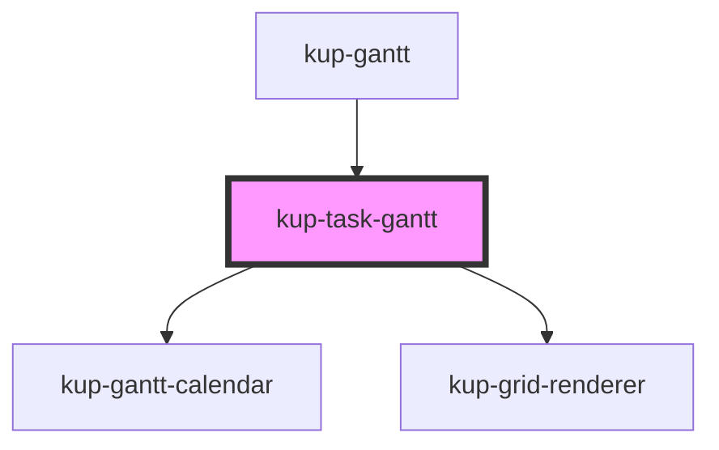

# kup-task-gantt

<!-- Auto Generated Below -->

## Properties

| Property        | Attribute      | Description | Type                                                                                                                                                                                                                                                                                                                                                                                                                                                                                                                                                                                                                                                                                           | Default     |
| --------------- | -------------- | ----------- | ---------------------------------------------------------------------------------------------------------------------------------------------------------------------------------------------------------------------------------------------------------------------------------------------------------------------------------------------------------------------------------------------------------------------------------------------------------------------------------------------------------------------------------------------------------------------------------------------------------------------------------------------------------------------------------------------- | ----------- |
| `barProps`      | --             |             | `{ tasks: KupPlannerBarTask[]; dates: Date[]; ganttEvent: GanttEvent; selectedTask: KupPlannerBarTask; rowHeight: number; columnWidth: number; timeStep: number; svg?: SVGSVGElement; svgWidth: number; taskHeight: number; arrowColor: string; arrowIndent: number; fontSize: string; fontFamily: string; rtl: boolean; ganttHeight: number; hideLabel?: boolean; showSecondaryDates?: boolean; currentDateIndicator?: CurrentDateIndicator; projection?: { x0: number; xf: number; color: string; }; readOnly: boolean; setGanttEvent: (value: GanttEvent) => void; setFailedTask: (value: KupPlannerBarTask) => void; setSelectedTask: (taskId: string) => void; } & KupPlannerEventOption` | `undefined` |
| `calendarProps` | --             |             | `{ dateSetup: DateSetup; locale: string; viewMode: KupPlannerViewMode; rtl: boolean; headerHeight: number; columnWidth: number; fontFamily: string; fontSize: string; dateTimeFormatters?: DateTimeFormatters; singleLineHeader: boolean; currentDateIndicator?: CurrentDateIndicator; }`                                                                                                                                                                                                                                                                                                                                                                                                      | `undefined` |
| `ganttHeight`   | `gantt-height` |             | `number`                                                                                                                                                                                                                                                                                                                                                                                                                                                                                                                                                                                                                                                                                       | `undefined` |
| `gridProps`     | --             |             | `{ tasks: KupPlannerTask[]; dates: Date[]; svgWidth: number; rowHeight: number; columnWidth: number; todayColor: string; rtl: boolean; }`                                                                                                                                                                                                                                                                                                                                                                                                                                                                                                                                                      | `undefined` |
| `scrollX`       | `scroll-x`     |             | `number`                                                                                                                                                                                                                                                                                                                                                                                                                                                                                                                                                                                                                                                                                       | `0`         |
| `scrollY`       | `scroll-y`     |             | `number`                                                                                                                                                                                                                                                                                                                                                                                                                                                                                                                                                                                                                                                                                       | `0`         |
| `taskGanttRef`  | --             |             | `HTMLDivElement`                                                                                                                                                                                                                                                                                                                                                                                                                                                                                                                                                                                                                                                                               | `undefined` |

## Dependencies

### Used by

 - [kup-gantt](../kup-gantt)

### Depends on

- [kup-gantt-calendar](../kup-gantt-calendar)
- [kup-grid-renderer](../kup-grid-renderer)

### Graph

----------------------------------------------

*Built with [StencilJS](https://stenciljs.com/)*
