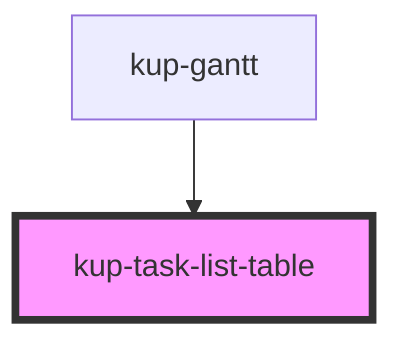

# kup-task-list-table

<!-- Auto Generated Below -->

## Properties

| Property | Attribute | Description | Type | Default |
| --- | --- | --- | --- | --- |
| `expanderClick` | -- |  | `(task: KupPlannerTask) => void` | `undefined` |
| `fontFamily` | `font-family` |  | `string` | `undefined` |
| `fontSize` | `font-size` |  | `string` | `undefined` |
| `locale` | `locale` |  | `string` | `undefined` |
| `rowHeight` | `row-height` |  | `number` | `undefined` |
| `rowWidth` | `row-width` |  | `string` | `undefined` |
| `selectedTaskId` | `selected-task-id` |  | `string` | `undefined` |
| `setSelectedTask` | -- |  | `(taskId: string) => void` | `undefined` |
| `tasks` | -- |  | `KupPlannerTask[]` | `undefined` |

## Dependencies

### Used by

-   [kup-gantt](../kup-gantt)

### Graph

---

_Built with [StencilJS](https://stenciljs.com/)_
