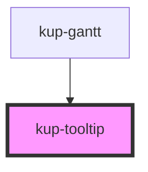

# kup-tooltip

<!-- Auto Generated Below -->

## Properties

| Property             | Attribute              | Description | Type                | Default     |
| -------------------- | ---------------------- | ----------- | ------------------- | ----------- |
| `TooltipContent`     | `tooltip-content`      |             | `any`               | `undefined` |
| `arrowIndent`        | `arrow-indent`         |             | `number`            | `undefined` |
| `fontFamily`         | `font-family`          |             | `string`            | `undefined` |
| `fontSize`           | `font-size`            |             | `string`            | `undefined` |
| `headerHeight`       | `header-height`        |             | `number`            | `undefined` |
| `rowHeight`          | `row-height`           |             | `number`            | `undefined` |
| `rtl`                | `rtl`                  |             | `boolean`           | `undefined` |
| `scrollX`            | `scroll-x`             |             | `number`            | `undefined` |
| `scrollY`            | `scroll-y`             |             | `number`            | `undefined` |
| `svgContainerHeight` | `svg-container-height` |             | `number`            | `undefined` |
| `svgContainerWidth`  | `svg-container-width`  |             | `number`            | `undefined` |
| `svgWidth`           | `svg-width`            |             | `number`            | `undefined` |
| `task`               | --                     |             | `KupPlannerBarTask` | `undefined` |
| `taskListWidth`      | `task-list-width`      |             | `number`            | `undefined` |

## Dependencies

### Used by

 - [kup-gantt](../kup-gantt)

### Graph

----------------------------------------------

*Built with [StencilJS](https://stenciljs.com/)*
