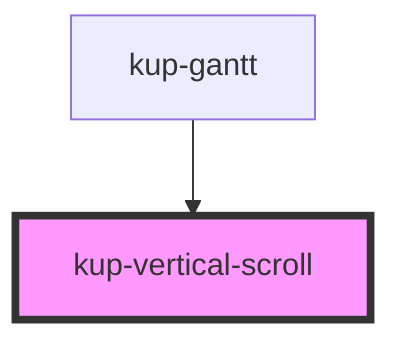

# kup-vertical-scroll

<!-- Auto Generated Below -->

## Properties

| Property          | Attribute           | Description | Type                       | Default     |
| ----------------- | ------------------- | ----------- | -------------------------- | ----------- |
| `ganttFullHeight` | `gantt-full-height` |             | `number`                   | `undefined` |
| `ganttHeight`     | `gantt-height`      |             | `number`                   | `undefined` |
| `headerHeight`    | `header-height`     |             | `number`                   | `undefined` |
| `rtl`             | `rtl`               |             | `boolean`                  | `undefined` |
| `scrollNumber`    | `scroll-number`     |             | `number`                   | `undefined` |
| `verticalScroll`  | --                  |             | `(event: UIEvent) => void` | `undefined` |

## Dependencies

### Used by

 - [kup-gantt](../kup-gantt)

### Graph

----------------------------------------------

*Built with [StencilJS](https://stenciljs.com/)*
