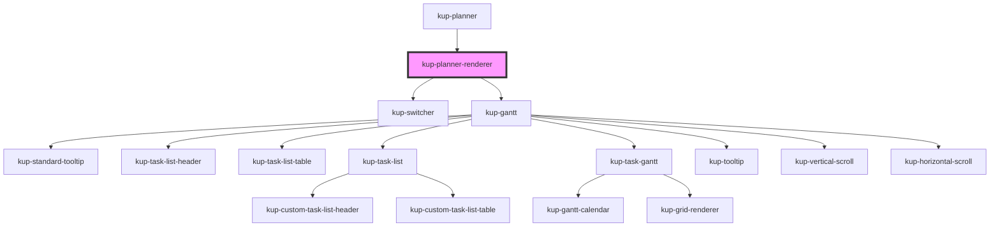

# kup-planner-renderer

<!-- Auto Generated Below -->

## Properties

| Property | Attribute | Description | Type           | Default     |
| -------- | --------- | ----------- | -------------- | ----------- |
| `props`  | --        |             | `PlannerProps` | `undefined` |

## Methods

### `refresh() => Promise<void>`

This method is used to trigger a new render of the component.

#### Returns

Type: `Promise<void>`

## Dependencies

### Used by

 - [kup-planner](..)

### Depends on

- [kup-switcher](kup-switcher)
- [kup-gantt](kup-gantt)

### Graph

----------------------------------------------

*Built with [StencilJS](https://stenciljs.com/)*
