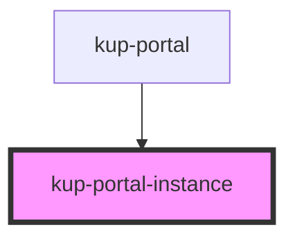

# kup-portal-instance

<!-- Auto Generated Below -->

## Properties

| Property                       | Attribute    | Description                                                          | Type                   | Default     |
| ------------------------------ | ------------ | -------------------------------------------------------------------- | ---------------------- | ----------- |
| `additionalAdoptedStyleSheets` | --           |                                                                      | `CSSStyleSheet[]`      | `[]`        |
| `isVisible`                    | `is-visible` | Specifies if the current portal instance should be displayed or not. | `boolean`              | `false`     |
| `styleNode`                    | --           | A style node to be copied into the KetchupPortalInstance             | `HTMLStyleElement`     | `undefined` |
| `vNodes`                       | --           | Virtual node list the KetchupPortalInstance must render              | `Element \| Element[]` | `null`      |

## Dependencies

### Used by

 - [kup-portal](..\kup-portal)

### Graph

----------------------------------------------

*Built with [StencilJS](https://stenciljs.com/)*
