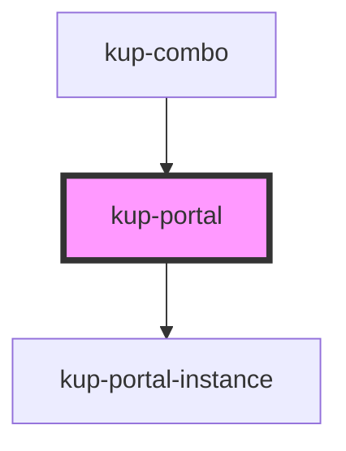

# kup-portal

## Usage and considerations

### 1. Why a portal element?

Due to how HTML and CSS works, some times it can be useful to detach an element from its current component tree and place it directly inside the body tag. 
This is especially true with components which must be placed absolutely and their position is relative to an element inside the flow.
Or on older browsers when using `position: fixed;`.

Great use examples of this component would be *menus, combo-box-menus, snack-bars and dialogs*. 

Many libraries, such as [React](https://reactjs.org/docs/portals.html#usage) and [Vue](https://github.com/LinusBorg/portal-vue),
have their own implementation of this component.

##### Pros
1. CSS cascading does not affect components passed trough a portal;
2. There are no problems with z-index and positioning elements;
3. Modals are easier.

##### Cons
1. CSS variables do not cascade.
2. With web components, you have to create your own way to pass styles which instead are needed by the component.
3. Events do not bubble up to the parent using the portal element.

These Cons can be patched in some way with JS, but not as in the same responsive way as the browser.

###### Cons Example 
Take as example the CSS vars propagation. The browser automatically propagates these properties with its own mechanism.
The most simple way to mirror these variables is to get the root of the web component, calculate the CSS vars when
the component is in the process of being updated, and set these vars through the `style` declaration.
Notice that if the component does not need to redraw itself, then changing a CSS var won't take effect until the next redraw is completed.

However, there is another problem with this approach: which CSS vars need to be copied?
Using `getComputedStyle` does not return directly the values of the CSS vars: you must access them trough a method.
To make it simple, you must know variable names you want to get in order to get and pass them down to the portal. 

### 2. Portals and Stencil

There are differences between a Stencil portal and a framework portal.

##### Usage

In React and Vue, you can directly place the HTML inside the portal component and everything works.
[Example here](https://portal-vue.linusb.org/guide/getting-started.html#usage).
This is because components are simply Vue element which gets resolved and whose dom gets compiled into plain HTML.

With web components there is no such composition.
If you declare a portal element and pass some child inside that component, they will be simply rendered in the light DOM of the current component.
Therefore will note be accessible to the portal element, unless you travel up the DOM and look for them.

Luckily, Stencil vDOM comes to the rescue here.
We can separate templating which goes into a portal into a function returning the template compiled into JSX.Elements.
Then we can pass this vTree to the portal component, which will pass it to the portalInstance component,
whose job is to render that tree.

In this way we have achieved the following:
1. The PortalInstance gets updated when the component using the portal gets updated.
2. Since we're using a vTree on which some event callbacks are bound with `.bind(this)`, when those events are triggered the corresponding methods gets triggered inside the component.

##### Event propagation

Framework portals, since they use a common JS object, they can simply use their directives and infrastructure to capture events
and propagate them to the component using the portal.

Contrariwise, Stencil is simply a compiler for web components which is using a virtual DOM system.
So, events which are listened to inside the compiled vNodes **are passed** to the parent component, since they use a virtual tree
for the bubbling, while other events, since are native DOM events, simply bubble up normally.

It is possible to create and set a listener for all events, and then bubble them up to the parent.
But this will consume a lot of resources.

A more convenient approach is to allow the portal component to return the portal instance and allow the component
using the portal to set its own event listeners on that element.

### 3. Conclusions

Sometimes portals are necessary to achieve a particular feature, so using a component which enables them can be useful.

But as a general rule and with all the problems they bring forward, especially if not inserted into a framework,
use portals only in edge cases requiring them, like the ones listed above.

## Resources

[Article](https://techblog.gumgum.com/articles/react-16s-stellar-new-portal-api)

<!-- Auto Generated Below -->

## Properties

| Property          | Attribute    | Description                                                                                    | Type                   | Default         |
| ----------------- | ------------ | ---------------------------------------------------------------------------------------------- | ---------------------- | --------------- |
| `isVisible`       | `is-visible` | Tells the portal instance if it can be visible or not                                          | `boolean`              | `false`         |
| `mirroredCssVars` | --           | Array of custom css vars which needs to be mirrored. Their value is computed from cssVarsRef   | `string[]`             | `[]`            |
| `nodes`           | --           | Virtual node list the KetchupPortalInstance must render                                        | `Element \| Element[]` | `undefined`     |
| `portalParentRef` | --           | Reference to the html element which is using the portal. It must be a root of a web component. | `HTMLElement`          | `undefined`     |
| `portalRootNode`  | --           | The HTML element on which the virtual node must be appended                                    | `HTMLElement`          | `document.body` |
| `refOffset`       | --           | Calculated offset of where the portal must be positioned                                       | `ElementOffset`        | `{}`            |
| `styleNode`       | --           | A style node to be copied into the KetchupPortalInstance                                       | `HTMLStyleElement`     | `undefined`     |

## Methods

### `getPortalInstance() => Promise<HTMLElement>`

Returns the root node instance of the KetchupPortalInstance element

#### Returns

Type: `Promise<HTMLElement>`

## Dependencies

### Used by

 - [kup-combo](..\kup-combo)

### Depends on

- [kup-portal-instance](..\kup-portal-instance)

### Graph

----------------------------------------------

*Built with [StencilJS](https://stenciljs.com/)*
