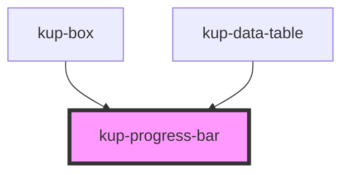

# kup-progress-bar

<!-- Auto Generated Below -->

## Properties

| Property    | Attribute    | Description                                                                                                    | Type      | Default     |
| ----------- | ------------ | -------------------------------------------------------------------------------------------------------------- | --------- | ----------- |
| `hideLabel` | `hide-label` | FLag to show or hide the progress bar's label                                                                  | `boolean` | `false`     |
| `isSmall`   | `is-small`   | Determines if the progress bar must be drawn in small mode For SmeUP users, this corresponds to V2fogog style. | `boolean` | `false`     |
| `labelText` | `label-text` | Specifies a text for the bar's label                                                                           | `string`  | `undefined` |
| `value`     | `value`      | The current value the progress bar must display.                                                               | `number`  | `0`         |

## CSS Custom Properties

| Name                                                | Description                                             |
| --------------------------------------------------- | ------------------------------------------------------- |
| `--pgb_background-color, --kup-pb_background-color` | Background color of the progress bar.                   |
| `--pgb_border-radius, --kup-pb_border-radius`       | Border radius of the bars, 5px default, 9px when small. |
| `--pgb_foreground-color, --kup-pb_foreground-color` | Foreground color of the progress bar.                   |
| `--pgb_text-color, --kup-pb_text-color`             | Text color.                                             |

## Dependencies

### Used by

 - [kup-box](..\kup-box)
 - [kup-data-table](..\kup-data-table)

### Graph

----------------------------------------------

*Built with [StencilJS](https://stenciljs.com/)*
