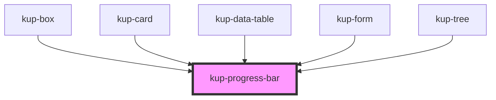

# kup-progress-bar

<!-- Auto Generated Below -->

## Properties

| Property        | Attribute        | Description                                                                                                         | Type      | Default     |
| --------------- | ---------------- | ------------------------------------------------------------------------------------------------------------------- | --------- | ----------- |
| `centeredLabel` | `centered-label` | Displays the label in the middle of the progress bar. It's the default for the radial variant and can't be changed. | `boolean` | `true`      |
| `customStyle`   | `custom-style`   | Custom style of the component. For more information: https://ketchup.smeup.com/ketchup-showcase/#/customization     | `string`  | `''`        |
| `hideLabel`     | `hide-label`     | Flag to show or hide the progress bar's label.                                                                      | `boolean` | `false`     |
| `icon`          | `icon`           | Specifies an icon to replace the label.                                                                             | `string`  | `undefined` |
| `isRadial`      | `is-radial`      | Radial version.                                                                                                     | `boolean` | `false`     |
| `label`         | `label`          | Specifies a text for the bar's label.                                                                               | `string`  | `undefined` |
| `value`         | `value`          | The current value the progress bar must display.                                                                    | `number`  | `0`         |

## Methods

### `getProps(descriptions?: boolean) => Promise<GenericObject>`

Used to retrieve component's props values.

#### Returns

Type: `Promise<GenericObject>`

### `refresh() => Promise<void>`

This method is used to trigger a new render of the component.

#### Returns

Type: `Promise<void>`

### `setProps(props: GenericObject) => Promise<void>`

Sets the props to the component.

#### Returns

Type: `Promise<void>`

## Dependencies

### Used by

 - [kup-box](../kup-box)
 - [kup-card](../kup-card)
 - [kup-data-table](../kup-data-table)
 - [kup-form](../kup-form)
 - [kup-tree](../kup-tree)

### Graph

----------------------------------------------

*Built with [StencilJS](https://stenciljs.com/)*
