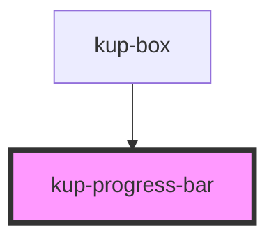

# kup-progress-bar

<!-- Auto Generated Below -->

## Properties

| Property    | Attribute    | Description | Type      | Default     |
| ----------- | ------------ | ----------- | --------- | ----------- |
| `hideLabel` | `hide-label` |             | `boolean` | `false`     |
| `labelText` | `label-text` |             | `string`  | `undefined` |
| `value`     | `value`      |             | `number`  | `0`         |

## Dependencies

### Used by

 - [kup-box](../kup-box)

### Graph

----------------------------------------------

*Built with [StencilJS](https://stenciljs.com/)*
