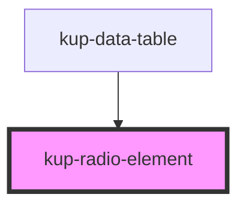

# kup-radio-element

<!-- Auto Generated Below -->

## Properties

| Property   | Attribute  | Description                                        | Type      | Default |
| ---------- | ---------- | -------------------------------------------------- | --------- | ------- |
| `checked`  | `checked`  | Specifies if the radio element is selected or not. | `boolean` | `false` |
| `disabled` | `disabled` | Flag: the radio button is disabled.                | `boolean` | `false` |
| `label`    | `label`    | Label to assign to the radio button.               | `string`  | `''`    |

## CSS Custom Properties

| Name                                                  | Description                                                |
| ----------------------------------------------------- | ---------------------------------------------------------- |
| `--rel_border-color, --kup-rel_border-color`          | Set default color of external border of the radio element  |
| `--rel_border-color--selected --kup-rel_border-color` | Set selected color of external border of the radio element |
| `--rel_color, --kup-rel_color`                        | Sets radio element color when selected radio appears       |
| `--rel_font-size, --kup-rel_font-size`                | Sets font size and icon radio button size (size * 1.4)     |
| `--rel_tr-duration, --kup-rel_transition-duration`    | Sets all components transitions duration                   |

## Dependencies

### Used by

 - [kup-data-table](../kup-data-table)

### Graph

----------------------------------------------

*Built with [StencilJS](https://stenciljs.com/)*
