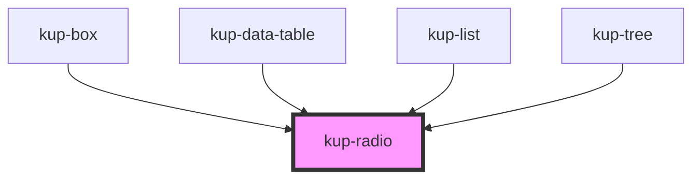

# kup-radio

<!-- Auto Generated Below -->

## Properties

| Property       | Attribute       | Description                                                                                                     | Type                      | Default        |
| -------------- | --------------- | --------------------------------------------------------------------------------------------------------------- | ------------------------- | -------------- |
| `customStyle`  | `custom-style`  | Custom style of the component. For more information: https://ketchup.smeup.com/ketchup-showcase/#/customization | `string`                  | `undefined`    |
| `data`         | --              | List of elements.                                                                                               | `ComponentRadioElement[]` | `[]`           |
| `disabled`     | `disabled`      | Defaults at false. When set to true, the component is disabled.                                                 | `boolean`                 | `false`        |
| `leadingLabel` | `leading-label` | Defaults at false. When set to true, the label will be on the left of the component.                            | `boolean`                 | `false`        |
| `name`         | `name`          | Defaults at null. It's the name that binds the radio buttons together.                                          | `string`                  | `'radio-list'` |

## Events

| Event            | Description | Type                                                |
| ---------------- | ----------- | --------------------------------------------------- |
| `kupRadioBlur`   |             | `CustomEvent<{ value: string; checked: boolean; }>` |
| `kupRadioChange` |             | `CustomEvent<{ value: string; checked: boolean; }>` |
| `kupRadioClick`  |             | `CustomEvent<{ value: string; checked: boolean; }>` |
| `kupRadioFocus`  |             | `CustomEvent<{ value: string; checked: boolean; }>` |
| `kupRadioInput`  |             | `CustomEvent<{ value: string; checked: boolean; }>` |

## Methods

### `refreshCustomStyle(customStyleTheme: string) => Promise<void>`

#### Returns

Type: `Promise<void>`

## Dependencies

### Used by

 - [kup-box](../kup-box)
 - [kup-data-table](../kup-data-table)
 - [kup-list](../kup-list)
 - [kup-tree](../kup-tree)

### Graph

----------------------------------------------

*Built with [StencilJS](https://stenciljs.com/)*
