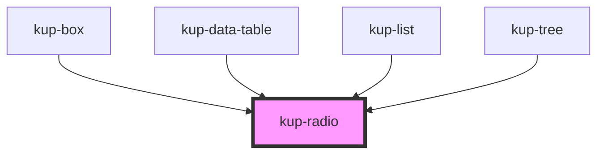

# kup-radio

<!-- Auto Generated Below -->

## Properties

| Property       | Attribute       | Description                                                                          | Type             | Default |
| -------------- | --------------- | ------------------------------------------------------------------------------------ | ---------------- | ------- |
| `columns`      | `columns`       | Number of columns. When null, radio fields will be displayed inline.                 | `number`         | `null`  |
| `customStyle`  | `custom-style`  | Custom style of the component.                                                       | `string`         | `''`    |
| `data`         | --              | List of elements.                                                                    | `KupRadioData[]` | `null`  |
| `disabled`     | `disabled`      | Defaults at false. When set to true, the component is disabled.                      | `boolean`        | `false` |
| `leadingLabel` | `leading-label` | Defaults at false. When set to true, the label will be on the left of the component. | `boolean`        | `false` |

## Events

| Event              | Description                                       | Type                                      |
| ------------------ | ------------------------------------------------- | ----------------------------------------- |
| `kup-radio-blur`   | Triggered when the input element loses focus.     | `CustomEvent<KupEventPayload>`            |
| `kup-radio-change` | Triggered when the input element's value changes. | `CustomEvent<KupRadioChangeEventPayload>` |
| `kup-radio-focus`  | Triggered when the input element gets focused.    | `CustomEvent<KupEventPayload>`            |

## Methods

### `getProps(descriptions?: boolean) => Promise<GenericObject>`

Used to retrieve component's props values.

#### Returns

Type: `Promise<GenericObject>`

### `refresh() => Promise<void>`

This method is used to trigger a new render of the component.

#### Returns

Type: `Promise<void>`

### `setProps(props: GenericObject) => Promise<void>`

Sets the props to the component.

#### Returns

Type: `Promise<void>`

## Dependencies

### Used by

 - [kup-box](../kup-box)
 - [kup-data-table](../kup-data-table)
 - [kup-list](../kup-list)
 - [kup-tree](../kup-tree)

### Graph

----------------------------------------------

*Built with [StencilJS](https://stenciljs.com/)*
