# kup-radio

<!-- Auto Generated Below -->

## Properties

| Property       | Attribute       | Description                                                                          | Type             | Default |
| -------------- | --------------- | ------------------------------------------------------------------------------------ | ---------------- | ------- |
| `columns`      | `columns`       | Number of columns. When null, radio fields will be displayed inline.                 | `number`         | `null`  |
| `customStyle`  | `custom-style`  | Custom style of the component.                                                       | `string`         | `''`    |
| `data`         | --              | List of elements.                                                                    | `KupRadioData[]` | `null`  |
| `disabled`     | `disabled`      | Defaults at false. When set to true, the component is disabled.                      | `boolean`        | `false` |
| `leadingLabel` | `leading-label` | Defaults at false. When set to true, the label will be on the left of the component. | `boolean`        | `false` |

## Events

| Event              | Description                                       | Type                                      |
| ------------------ | ------------------------------------------------- | ----------------------------------------- |
| `kup-radio-blur`   | Triggered when the input element loses focus.     | `CustomEvent<KupEventPayload>`            |
| `kup-radio-change` | Triggered when the input element's value changes. | `CustomEvent<KupRadioChangeEventPayload>` |
| `kup-radio-focus`  | Triggered when the input element gets focused.    | `CustomEvent<KupEventPayload>`            |

## Methods

### `getProps(descriptions?: boolean) => Promise<GenericObject>`

Used to retrieve component's props values.

#### Returns

Type: `Promise<GenericObject>`

List of props as object, each key will be a prop.

### `refresh() => Promise<void>`

This method is used to trigger a new render of the component.

#### Returns

Type: `Promise<void>`

### `setProps(props: GenericObject) => Promise<void>`

Sets the props to the component.

#### Returns

Type: `Promise<void>`

## CSS Custom Properties

| Name                             | Description                                     |
| -------------------------------- | ----------------------------------------------- |
| `--kup-radio-font-family`        | Sets font family of the radio's label.          |
| `--kup-radio-font-size`          | Sets font size of the radio's label.            |
| `--kup-radio-font-weight`        | Sets font weight of the radio's label.          |
| `--kup-radio-outer-circle-color` | Sets color of the outer circle.                 |
| `--kup-radio-primary-color`      | Sets primary color of the component.            |
| `--kup-radio-primary-color-rgb`  | Sets primary color RGB values of the component. |
| `--kup-radio-text-color`         | Sets text color of the radio's label.           |

## Dependencies

### Used by

 - [kup-box](../kup-box)
 - [kup-card](../kup-card)
 - [kup-cell](../kup-cell)
 - [kup-data-table](../kup-data-table)
 - [kup-form](../kup-form)
 - [kup-image-list](../kup-image-list)
 - [kup-list](../kup-list)
 - [kup-tree](../kup-tree)

### Depends on

- [kup-card](../kup-card)

### Graph

```mermaid
graph TD;
  kup-radio --> kup-card
  kup-card --> kup-radio
  kup-autocomplete --> kup-list
  kup-autocomplete --> kup-card
  kup-list --> kup-radio
  kup-badge --> kup-badge
  kup-badge --> kup-card
  kup-color-picker --> kup-card
  kup-combobox --> kup-list
  kup-combobox --> kup-card
  kup-date-picker --> kup-card
  kup-rating --> kup-card
  kup-time-picker --> kup-card
  kup-time-picker --> kup-list
  kup-image --> kup-spinner
  kup-image --> kup-card
  kup-image --> kup-badge
  kup-spinner --> kup-card
  kup-button --> kup-card
  kup-button --> kup-badge
  kup-button-list --> kup-dropdown-button
  kup-button-list --> kup-card
  kup-button-list --> kup-badge
  kup-dropdown-button --> kup-list
  kup-dropdown-button --> kup-card
  kup-dropdown-button --> kup-badge
  kup-chart --> kup-card
  kup-gauge --> kup-card
  kup-progress-bar --> kup-card
  kup-chip --> kup-card
  kup-chip --> kup-badge
  kup-form --> kup-radio
  kup-checkbox --> kup-card
  kup-text-field --> kup-card
  kup-data-table --> kup-radio
  kup-switch --> kup-card
  kup-tab-bar --> kup-card
  kup-tab-bar --> kup-badge
  kup-tree --> kup-radio
  kup-box --> kup-radio
  kup-cell --> kup-radio
  kup-image-list --> kup-radio
  style kup-radio fill:#f9f,stroke:#333,stroke-width:4px
```

----------------------------------------------

*Built with [StencilJS](https://stenciljs.com/)*
