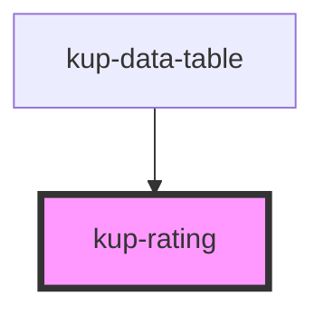

# kup-rating

<!-- Auto Generated Below -->

## Properties

| Property   | Attribute   | Description                                                     | Type      | Default |
| ---------- | ----------- | --------------------------------------------------------------- | --------- | ------- |
| `disabled` | `disabled`  | Defaults at false. When set to true, the component is disabled. | `boolean` | `false` |
| `maxValue` | `max-value` | Max number of stars (default 5)                                 | `number`  | `5`     |
| `value`    | `value`     | Rated stars                                                     | `number`  | `0`     |

## Events

| Event              | Description | Type               |
| ------------------ | ----------- | ------------------ |
| `kupRatingClicked` |             | `CustomEvent<any>` |

## Dependencies

### Used by

 - [kup-data-table](../kup-data-table)

### Graph

----------------------------------------------

*Built with [StencilJS](https://stenciljs.com/)*
