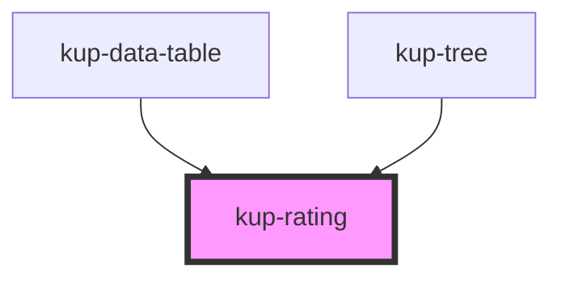

# kup-rating

<!-- Auto Generated Below -->

## Properties

| Property      | Attribute      | Description                                                     | Type      | Default |
| ------------- | -------------- | --------------------------------------------------------------- | --------- | ------- |
| `customStyle` | `custom-style` | Custom style of the component.                                  | `string`  | `''`    |
| `disabled`    | `disabled`     | Defaults at false. When set to true, the component is disabled. | `boolean` | `false` |
| `maxValue`    | `max-value`    | Max number of stars (default 5).                                | `number`  | `5`     |
| `value`       | `value`        | Rated stars.                                                    | `number`  | `0`     |

## Events

| Event              | Description | Type                                      |
| ------------------ | ----------- | ----------------------------------------- |
| `kup-rating-click` |             | `CustomEvent<KupRatingClickEventPayload>` |

## Methods

### `getProps(descriptions?: boolean) => Promise<GenericObject>`

Used to retrieve component's props values.

#### Returns

Type: `Promise<GenericObject>`

List of props as object, each key will be a prop.

### `refresh() => Promise<void>`

This method is used to trigger a new render of the component.

#### Returns

Type: `Promise<void>`

### `setProps(props: GenericObject) => Promise<void>`

Sets the props to the component.

#### Returns

Type: `Promise<void>`

## CSS Custom Properties

| Name                     | Description                      |
| ------------------------ | -------------------------------- |
| `--kup-rating-color`     | Sets color of the component.     |
| `--kup-rating-font-size` | Sets font size of the component. |

## Dependencies

### Used by

 - [kup-data-table](../kup-data-table)
 - [kup-tree](../kup-tree)

### Graph

----------------------------------------------

*Built with [StencilJS](https://stenciljs.com/)*
