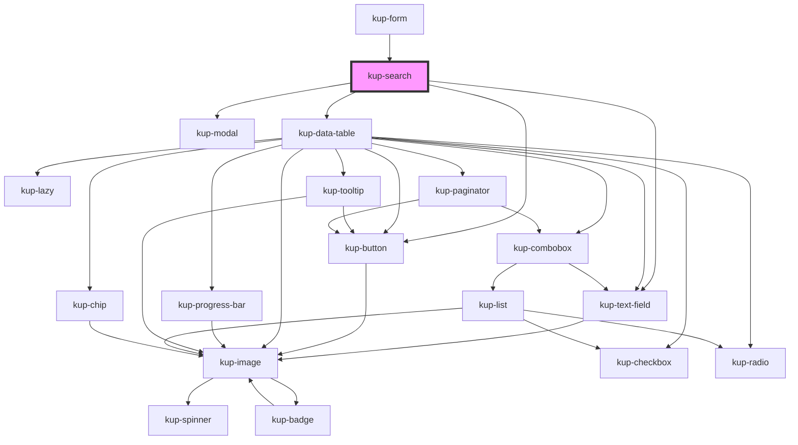

# kup-search

<!-- Auto Generated Below -->

## Properties

| Property                          | Attribute               | Description                                                                                                                                                              | Type                                                               | Default     |
| --------------------------------- | ----------------------- | ------------------------------------------------------------------------------------------------------------------------------------------------------------------------ | ------------------------------------------------------------------ | ----------- |
| `data`                            | --                      |                                                                                                                                                                          | `TableData`                                                        | `undefined` |
| `disabled`                        | `disabled`              |                                                                                                                                                                          | `boolean`                                                          | `false`     |
| `extra`                           | `extra`                 |                                                                                                                                                                          | `any`                                                              | `undefined` |
| `initialValue`                    | `initial-value`         |                                                                                                                                                                          | `string`                                                           | `''`        |
| `searchCallBackOnFilterSubmitted` | --                      | /** Function that can be invoked when the filter is submitted, but only if in serverHandledFilter mode. It returns the items filtered.                                   | `(detail: SearchFilterSubmittedEventDetail) => Promise<TableData>` | `undefined` |
| `serverHandledFilter`             | `server-handled-filter` | When true it emits events or makes available callbacks useful to obtain and filter data. When false the data inside data prop will be used and filtered in a static way. | `boolean`                                                          | `false`     |
| `valueField`                      | `value-field`           | The field used to obtain value                                                                                                                                           | `string`                                                           | `undefined` |

## Events

| Event                       | Description                                                                 | Type                                             |
| --------------------------- | --------------------------------------------------------------------------- | ------------------------------------------------ |
| `kupSearchFilterSubmitted`  | Fired when the filter is submitted but only if in serverHandledFilter mode. | `CustomEvent<SearchFilterSubmittedEventDetail>`  |
| `kupSearchSelectionUpdated` |                                                                             | `CustomEvent<SearchSelectionUpdatedEventDetail>` |

## Dependencies

### Used by

 - [kup-form](../kup-form)

### Depends on

- [kup-text-field](../kup-text-field)
- [kup-button](../kup-button)
- [kup-modal](../kup-modal)
- [kup-data-table](../kup-data-table)

### Graph

----------------------------------------------

*Built with [StencilJS](https://stenciljs.com/)*
