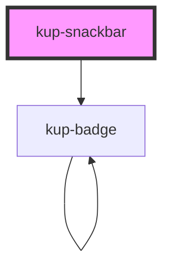

# kup-snackbar

### Features to add:

-   Main label support: by using a label tag and a generated id.
-   Support aria-labelledby attribute.

<!-- Auto Generated Below -->

## Properties

| Property       | Attribute       | Description                                                                                                   | Type                                                                                                                        | Default                 |
| -------------- | --------------- | ------------------------------------------------------------------------------------------------------------- | --------------------------------------------------------------------------------------------------------------------------- | ----------------------- |
| `actionButton` | `action-button` | If true the action button appears                                                                             | `boolean`                                                                                                                   | `false`                 |
| `buttonText`   | `button-text`   | Set text of the action button                                                                                 | `string`                                                                                                                    | `'Action'`              |
| `closeAction`  | `close-action`  | If true the close button appears                                                                              | `boolean`                                                                                                                   | `false`                 |
| `styling`      | `styling`       | Defines the style of the button. Styles available: "flat", "outlined" and "raised" which is also the default. | `FButtonStyling.FLAT \| FButtonStyling.FLOATING \| FButtonStyling.ICON \| FButtonStyling.OUTLINED \| FButtonStyling.RAISED` | `FButtonStyling.RAISED` |
| `text`         | `text`          | Gets/sets the textContent of the label element.                                                               | `string`                                                                                                                    | `''`                    |
| `timeout`      | `timeout`       | Default at 0. Gets/sets the automatic dismiss timeout in milliseconds.                                        | `number`                                                                                                                    | `null`                  |

## Events

| Event                      | Description                                        | Type                           |
| -------------------------- | -------------------------------------------------- | ------------------------------ |
| `kup-snackbar-actionclick` | Triggered when close or action button are clicked. | `CustomEvent<KupEventPayload>` |

## Methods

### `getProps(descriptions?: boolean) => Promise<GenericObject>`

Used to retrieve component's props values.

#### Returns

Type: `Promise<GenericObject>`

List of props as object, each key will be a prop.

### `hide() => Promise<void>`

Method to close the snackbar

#### Returns

Type: `Promise<void>`

### `refresh() => Promise<void>`

This method is used to trigger a new render of the component.

#### Returns

Type: `Promise<void>`

### `setProps(props: GenericObject) => Promise<void>`

Sets the props to the component.

#### Returns

Type: `Promise<void>`

### `show() => Promise<void>`

Method to open the snackbar

#### Returns

Type: `Promise<void>`

## Dependencies

### Depends on

- [kup-badge](../kup-badge)

### Graph

----------------------------------------------

*Built with [StencilJS](https://stenciljs.com/)*
