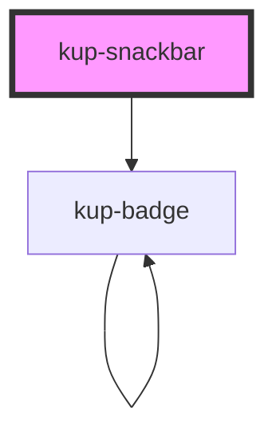

# kup-snackbar

### Features to add:

-   Main label support: by using a label tag and a generated id.
-   Support aria-labelledby attribute.

<!-- Auto Generated Below -->

## Properties

| Property       | Attribute      | Description                                                                                                      | Type           | Default |
| -------------- | -------------- | ---------------------------------------------------------------------------------------------------------------- | -------------- | ------- |
| `actionButton` | --             | Set of FButton props to set the action button.                                                                   | `FButtonProps` | `null`  |
| `closeButton`  | `close-button` | When true, the hide button will be displayed.                                                                    | `boolean`      | `true`  |
| `customStyle`  | `custom-style` | Custom style of the component.                                                                                   | `string`       | `''`    |
| `text`         | `text`         | Sets the textual content of the snackbar.                                                                        | `string`       | `''`    |
| `timeout`      | `timeout`      | Defaults at null, when set the snackbar will automatically disappear after the specified amount of milliseconds. | `number`       | `null`  |

## Events

| Event                      | Description                              | Type                           |
| -------------------------- | ---------------------------------------- | ------------------------------ |
| `kup-snackbar-actionclick` | Triggered when action button is clicked. | `CustomEvent<KupEventPayload>` |

## Methods

### `getProps(descriptions?: boolean) => Promise<GenericObject>`

Used to retrieve component's props values.

#### Returns

Type: `Promise<GenericObject>`

List of props as object, each key will be a prop.

### `hide() => Promise<void>`

Hides the snackbar.

#### Returns

Type: `Promise<void>`

### `refresh() => Promise<void>`

This method is used to trigger a new render of the component.

#### Returns

Type: `Promise<void>`

### `setProps(props: GenericObject) => Promise<void>`

Sets the props to the component.

#### Returns

Type: `Promise<void>`

### `show() => Promise<void>`

Displays the snackbar.

#### Returns

Type: `Promise<void>`

## Dependencies

### Depends on

- [kup-badge](../kup-badge)

### Graph

----------------------------------------------

*Built with [StencilJS](https://stenciljs.com/)*
