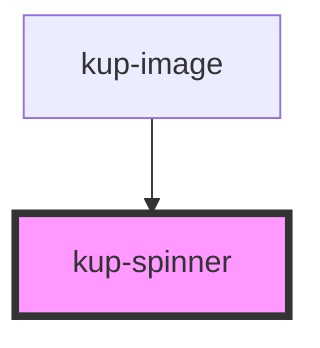

# kup-spinner

<!-- Auto Generated Below -->

## Properties

| Property        | Attribute        | Description                                                                                                      | Type      | Default     |
| --------------- | ---------------- | ---------------------------------------------------------------------------------------------------------------- | --------- | ----------- |
| `active`        | `active`         | When set to true the spinner is animating.                                                                       | `boolean` | `false`     |
| `barVariant`    | `bar-variant`    | Decides whether the component is a bar or a spinner.                                                             | `boolean` | `false`     |
| `customStyle`   | `custom-style`   | Custom style of the component. For more information: https://ketchup.smeup.com/ketchup-showcase/#/customization  | `string`  | `undefined` |
| `dimensions`    | `dimensions`     | Width and height of the spinner. For the bar variant, only height.                                               | `string`  | `undefined` |
| `fader`         | `fader`          | Places a blend modal over the wrapper to darken the view (or lighten, when the theme is dark).                   | `boolean` | `false`     |
| `faderTimeout`  | `fader-timeout`  | The time required for the "fader" to trigger.                                                                    | `number`  | `3500`      |
| `fullScreen`    | `full-screen`    | When set to true the component will fill the whole viewport.                                                     | `boolean` | `false`     |
| `isUnclickable` | `is-unclickable` | When set to true the area covered by the component will be unclickable and the cursor will be changed to "wait". | `boolean` | `false`     |
| `layout`        | `layout`         | Sets the layout of the spinner.                                                                                  | `number`  | `1`         |

## Methods

### `refreshCustomStyle(customStyleTheme: string) => Promise<void>`

#### Returns

Type: `Promise<void>`

## Dependencies

### Used by

 - [kup-image](../kup-image)

### Graph

----------------------------------------------

*Built with [StencilJS](https://stenciljs.com/)*
