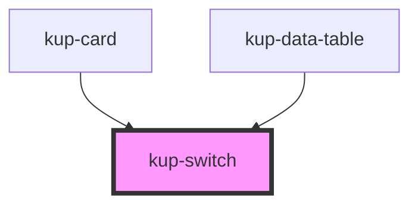

# kup-switch

<!-- Auto Generated Below -->

## Properties

| Property       | Attribute       | Description                                                                          | Type      | Default |
| -------------- | --------------- | ------------------------------------------------------------------------------------ | --------- | ------- |
| `checked`      | `checked`       | Defaults at false. When set to true, the component will be set to 'checked'.         | `boolean` | `false` |
| `customStyle`  | `custom-style`  | Custom style of the component.                                                       | `string`  | `''`    |
| `disabled`     | `disabled`      | Defaults at false. When set to true, the component is disabled.                      | `boolean` | `false` |
| `label`        | `label`         | Defaults at null. When specified, its content will be shown as a label.              | `string`  | `null`  |
| `leadingLabel` | `leading-label` | Defaults at false. When set to true, the label will be on the left of the component. | `boolean` | `false` |

## Events

| Event               | Description                                       | Type                                 |
| ------------------- | ------------------------------------------------- | ------------------------------------ |
| `kup-switch-blur`   | Triggered when the input element loses focus.     | `CustomEvent<KupSwitchEventPayload>` |
| `kup-switch-change` | Triggered when the input element's value changes. | `CustomEvent<KupSwitchEventPayload>` |
| `kup-switch-focus`  | Triggered when the input element gets focused.    | `CustomEvent<KupSwitchEventPayload>` |

## Methods

### `getProps(descriptions?: boolean) => Promise<GenericObject>`

Used to retrieve component's props values.

#### Returns

Type: `Promise<GenericObject>`

### `refresh() => Promise<void>`

This method is used to trigger a new render of the component.

#### Returns

Type: `Promise<void>`

### `setProps(props: GenericObject) => Promise<void>`

Sets the props to the component.

#### Returns

Type: `Promise<void>`

## Dependencies

### Used by

 - [kup-card](../kup-card)
 - [kup-data-table](../kup-data-table)

### Graph

----------------------------------------------

*Built with [StencilJS](https://stenciljs.com/)*
