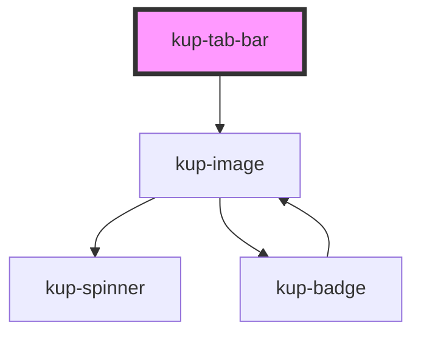

# kup-tab-bar

<!-- Auto Generated Below -->

## Properties

| Property      | Attribute      | Description                                                                                                     | Type                       | Default     |
| ------------- | -------------- | --------------------------------------------------------------------------------------------------------------- | -------------------------- | ----------- |
| `customStyle` | `custom-style` | Custom style of the component. For more information: https://ketchup.smeup.com/ketchup-showcase/#/customization | `string`                   | `undefined` |
| `data`        | --             | List of elements.                                                                                               | `ComponentTabBarElement[]` | `[]`        |

## Events

| Event            | Description | Type                                               |
| ---------------- | ----------- | -------------------------------------------------- |
| `kupTabBarBlur`  |             | `CustomEvent<{ index: number; el: EventTarget; }>` |
| `kupTabBarClick` |             | `CustomEvent<{ index: number; el: EventTarget; }>` |
| `kupTabBarFocus` |             | `CustomEvent<{ index: number; el: EventTarget; }>` |

## Methods

### `refreshCustomStyle(customStyleTheme: string) => Promise<void>`

#### Returns

Type: `Promise<void>`

## Dependencies

### Depends on

- [kup-image](../kup-image)

### Graph

----------------------------------------------

*Built with [StencilJS](https://stenciljs.com/)*
