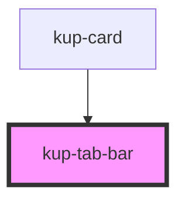

# kup-tab-bar

<!-- Auto Generated Below -->

## Properties

| Property      | Attribute      | Description                                                                                                     | Type                       | Default |
| ------------- | -------------- | --------------------------------------------------------------------------------------------------------------- | -------------------------- | ------- |
| `customStyle` | `custom-style` | Custom style of the component. For more information: https://ketchup.smeup.com/ketchup-showcase/#/customization | `string`                   | `''`    |
| `data`        | --             | List of elements.                                                                                               | `ComponentTabBarElement[]` | `[]`    |

## Events

| Event            | Description | Type                                                                          |
| ---------------- | ----------- | ----------------------------------------------------------------------------- |
| `kupTabBarBlur`  |             | `CustomEvent<{ index: number; el: EventTarget; }>`                            |
| `kupTabBarClick` |             | `CustomEvent<{ id: string; index: number; el: EventTarget; value: string; }>` |
| `kupTabBarFocus` |             | `CustomEvent<{ index: number; el: EventTarget; }>`                            |

## Methods

### `getProps(descriptions?: boolean) => Promise<GenericObject>`

Used to retrieve component's props values.

#### Returns

Type: `Promise<GenericObject>`

### `refresh() => Promise<void>`

This method is used to trigger a new render of the component.

#### Returns

Type: `Promise<void>`

## Dependencies

### Used by

 - [kup-card](../kup-card)

### Graph

----------------------------------------------

*Built with [StencilJS](https://stenciljs.com/)*
