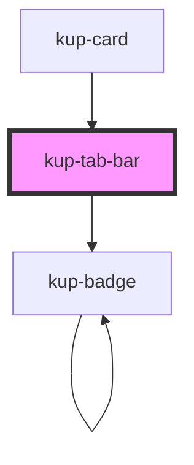

# kup-tab-bar

<!-- Auto Generated Below -->

## Properties

| Property      | Attribute      | Description                    | Type              | Default |
| ------------- | -------------- | ------------------------------ | ----------------- | ------- |
| `customStyle` | `custom-style` | Custom style of the component. | `string`          | `''`    |
| `data`        | --             | List of elements.              | `KupTabBarData[]` | `null`  |

## Events

| Event              | Description                         | Type                                      |
| ------------------ | ----------------------------------- | ----------------------------------------- |
| `kup-tabbar-blur`  | Triggered when the tab loses focus. | `CustomEvent<KupTabBarEventPayload>`      |
| `kup-tabbar-click` | Triggered when the tab is clicked.  | `CustomEvent<KupTabBarClickEventPayload>` |
| `kup-tabbar-focus` | Triggered when the tab is focused.  | `CustomEvent<KupTabBarEventPayload>`      |

## Methods

### `getProps(descriptions?: boolean) => Promise<GenericObject>`

Used to retrieve component's props values.

#### Returns

Type: `Promise<GenericObject>`

### `refresh() => Promise<void>`

This method is used to trigger a new render of the component.

#### Returns

Type: `Promise<void>`

### `setProps(props: GenericObject) => Promise<void>`

Sets the props to the component.

#### Returns

Type: `Promise<void>`

## Dependencies

### Used by

 - [kup-card](../kup-card)

### Depends on

- [kup-badge](../kup-badge)

### Graph

----------------------------------------------

*Built with [StencilJS](https://stenciljs.com/)*
