# kup-text-field

<!-- Auto Generated Below -->

## Properties

| Property | Attribute | Description | Type | Default |
| --- | --- | --- | --- | --- |
| `alert` | `alert` | Set alert message | `string` | `''` |
| `allowNegative` | `allow-negative` | When true, could be input negative numbers (should be used when inputType is number). | `boolean` | `false` |
| `customStyle` | `custom-style` | Custom style of the component. | `string` | `''` |
| `decimals` | `decimals` | Number of decimals (should be used when inputType is number). | `number` | `null` |
| `disabled` | `disabled` | When set to true, the component is disabled. | `boolean` | `false` |
| `emitSubmitEventOnEnter` | `emit-submit-event-on-enter` | When the text field is part of the autocomplete component and the list is opened, enter key selects the item and doesn't submit. | `boolean` | `true` |
| `error` | `error` | Set error message | `string` | `''` |
| `fullWidth` | `full-width` | When set to true, the component will be rendered at full width. | `boolean` | `false` |
| `group` | `group` | When true, the number will be formatted with group separator (should be used when inputType is number). | `boolean` | `false` |
| `helper` | `helper` | When set, its content will be shown as a help text below the field. | `string` | `null` |
| `helperEnabled` | `helper-enabled` | When true, the helper will be displayed. | `boolean` | `true` |
| `helperIcon` | `helper-icon` | When set, its content will be shown as a help icon inside the field. | `boolean` | `false` |
| `helperWhenFocused` | `helper-when-focused` | When set, the helper will be shown only when the field is focused. | `boolean` | `false` |
| `icon` | `icon` | When set, the text-field will show this icon. | `string` | `null` |
| `initialValue` | `initial-value` | Sets the initial value of the component | `string` | `''` |
| `inputMode` | `input-mode` | The HTML inputmode of the input element. | `string` | `null` |
| `inputType` | `input-type` | The HTML type of the input element. It has no effect on text areas. | `string` | `'text'` |
| `integers` | `integers` | Number of integers (should be used when inputType is number). | `number` | `null` |
| `isClearable` | `is-clearable` | Enables a clear trailing icon. | `boolean` | `false` |
| `label` | `label` | When set, its content will be shown as a label. | `string` | `null` |
| `leadingLabel` | `leading-label` | When set to true, the label will be on the left of the component. | `boolean` | `false` |
| `lightMode` | `light-mode` | When set to true, the label will be on the left of the component. | `boolean` | `false` |
| `max` | `max` | The HTML max attribute specifies the maximum value for the input element. Works with the following input types: number, range, date, datetime-local, month, time and week. | `number` | `null` |
| `maxLength` | `max-length` | When set, the helper will display a character counter. | `number` | `null` |
| `min` | `min` | The HTML min attribute specifies the minimum value for the input element. Works with the following input types: number, range, date, datetime-local, month, time and week. | `number` | `null` |
| `name` | `name` | The HTML name attribute used for form autocomplete. | `string` | `null` |
| `outlined` | `outlined` | When set to true, the component will be rendered as an outlined field. | `boolean` | `false` |
| `placeholder` | `placeholder` | Set the placeholder value. It's an example, not a label. | `string` | `''` |
| `quantityButtons` | `quantity-buttons` | When set, appear 2 buttons to increment and decrement the value. | `boolean` | `false` |
| `readOnly` | `read-only` | Sets the component to read only state, making it not editable, but interactable. Used in combobox component when it behaves as a select. | `boolean` | `false` |
| `showCounter` | `show-counter` | Hides the character counter. | `boolean` | `false` |
| `size` | `size` | The HTML attribute size of the input element. | `number` | `null` |
| `sizing` | `sizing` | Sets the sizing of the textfield | `KupComponentSizing.EXTRA_LARGE \| KupComponentSizing.EXTRA_SMALL \| KupComponentSizing.LARGE \| KupComponentSizing.MEDIUM \| KupComponentSizing.SMALL` | `KupComponentSizing.SMALL` |
| `step` | `step` | The HTML step of the input element. It has effect only with number input type. | `number` | `null` |
| `textArea` | `text-area` | When set to true, the component will be rendered as a textarea. | `boolean` | `false` |
| `trailingIcon` | `trailing-icon` | When set, the icon will be shown after the text. | `boolean` | `false` |
| `trailingLabel` | `trailing-label` | When set to true, the label will be on the right of the component. | `boolean` | `false` |

## Events

| Event | Description | Type |
| --- | --- | --- |
| `kup-textfield-blur` | Triggered when the input element loses focus. | `CustomEvent<KupTextFieldEventPayload>` |
| `kup-textfield-change` | Triggered when the input element changes. | `CustomEvent<KupTextFieldEventPayload>` |
| `kup-textfield-cleariconclick` | Triggered when the text field's clear icon is clicked. | `CustomEvent<KupEventPayload>` |
| `kup-textfield-click` | Triggered when the input element is clicked. | `CustomEvent<KupTextFieldEventPayload>` |
| `kup-textfield-focus` | Triggered when the input element gets focused. | `CustomEvent<KupTextFieldEventPayload>` |
| `kup-textfield-iconclick` | Triggered when the text field's icon is clicked. | `CustomEvent<KupTextFieldEventPayload>` |
| `kup-textfield-input` | Triggered when the input element receives an input. | `CustomEvent<KupTextFieldEventPayload>` |
| `kup-textfield-minusclick` | Triggered when the - button of the number type component is pressed. | `CustomEvent<KupTextFieldEventPayload>` |
| `kup-textfield-plusclick` | Triggered when the + button of the number type component is pressed. | `CustomEvent<KupTextFieldEventPayload>` |
| `kup-textfield-submit` | Triggered when the Enter key is pressed. | `CustomEvent<KupTextFieldEventPayload>` |

## Methods

### `getProps(descriptions?: boolean) => Promise<GenericObject>`

Used to retrieve component's props values.

#### Parameters

| Name | Type | Description |
| --- | --- | --- |
| `descriptions` | `boolean` | - When provided and true, the result will be the list of props with their description. |

#### Returns

Type: `Promise<GenericObject>`

List of props as object, each key will be a prop.

### `getValue() => Promise<string>`

Returns the component's internal value.

#### Returns

Type: `Promise<string>`

### `refresh() => Promise<void>`

This method is used to trigger a new render of the component.

#### Returns

Type: `Promise<void>`

### `setFocus() => Promise<void>`

Focuses the input element.

#### Returns

Type: `Promise<void>`

### `setProps(props: GenericObject) => Promise<void>`

Sets the props to the component.

#### Parameters

| Name | Type | Description |
| --- | --- | --- |
| `props` | `GenericObject` | - Object containing props that will be set to the component. |

#### Returns

Type: `Promise<void>`

### `setValue(value: string, skipNumberCheck?: boolean) => Promise<void>`

Sets the internal value of the component.

#### Parameters

| Name              | Type      | Description |
| ----------------- | --------- | ----------- |
| `value`           | `string`  |             |
| `skipNumberCheck` | `boolean` |             |

#### Returns

Type: `Promise<void>`

### `waitForReady() => Promise<void>`

Public method to wait until the component is fully ready.

#### Returns

Type: `Promise<void>`

## CSS Custom Properties

| Name | Description |
| --- | --- |
| `--kup-textfield-background-color-rgb` | Sets the background shader of the field, must be a set of RGB values. |
| `--kup-textfield-color` | Sets text color of the text field. |
| `--kup-textfield-color-rgb` | Sets text color RGB values of the text field (used for shaders). |
| `--kup-textfield-font-family` | Sets font family of the component. |
| `--kup-textfield-font-size` | Sets font size of the component. |
| `--kup-textfield-font-weight` | Sets font weight of the component. |
| `--kup-textfield-fullwidth-height` | Sets height of the component when fullwidth. |
| `--kup-textfield-fullwidth-padding` | Sets padding of the component when fullwidth. |
| `--kup-textfield-icon-color` | Sets icon color of the component. |
| `--kup-textfield-primary-color` | Sets primary color of the text field. |
| `--kup-textfield-primary-color-rgb` | Sets primary color RGB values of the text field (used for shaders). |
| `--kup-textfield-text-align` | Sets the text alignment of the text field. |
| `--kup-textfield-width` | Sets the width of the text field. NOTE: These variables are defined in the "kup-theme.css" file, because they must work even without the kup component (it's a functional component) |

## Dependencies

### Used by

-   [kup-box](../kup-box)
-   [kup-card](../kup-card)
-   [kup-cell](../kup-cell)
-   [kup-data-table](../kup-data-table)
-   [kup-form](../kup-form)
-   [kup-image-list](../kup-image-list)
-   [kup-input-panel](../kup-input-panel)
-   [kup-magic-box](../kup-magic-box)
-   [kup-toolbar](../kup-toolbar)
-   [kup-tree](../kup-tree)

### Depends on

-   [kup-card](../kup-card)
-   [kup-badge](../kup-badge)

### Graph

```mermaid
graph TD;
  kup-text-field --> kup-card
  kup-text-field --> kup-badge
  kup-card --> kup-text-field
  kup-image --> kup-card
  kup-image --> kup-image
  kup-image --> kup-dialog
  kup-image --> kup-spinner
  kup-image --> kup-badge
  kup-dialog --> kup-badge
  kup-dialog --> kup-card
  kup-dialog --> kup-dialog
  kup-badge --> kup-badge
  kup-badge --> kup-card
  kup-badge --> kup-dialog
  kup-spinner --> kup-card
  kup-spinner --> kup-dialog
  kup-autocomplete --> kup-list
  kup-autocomplete --> kup-card
  kup-autocomplete --> kup-dialog
  kup-autocomplete --> kup-badge
  kup-list --> kup-list
  kup-list --> kup-radio
  kup-list --> kup-card
  kup-list --> kup-dialog
  kup-list --> kup-badge
  kup-radio --> kup-card
  kup-radio --> kup-dialog
  kup-radio --> kup-badge
  kup-chip --> kup-card
  kup-chip --> kup-dialog
  kup-chip --> kup-badge
  kup-color-picker --> kup-card
  kup-color-picker --> kup-dialog
  kup-color-picker --> kup-badge
  kup-combobox --> kup-list
  kup-combobox --> kup-card
  kup-combobox --> kup-dialog
  kup-combobox --> kup-badge
  kup-date-picker --> kup-card
  kup-date-picker --> kup-dialog
  kup-date-picker --> kup-badge
  kup-rating --> kup-card
  kup-rating --> kup-dialog
  kup-time-picker --> kup-card
  kup-time-picker --> kup-list
  kup-time-picker --> kup-dialog
  kup-time-picker --> kup-badge
  kup-button-list --> kup-dropdown-button
  kup-button-list --> kup-card
  kup-button-list --> kup-badge
  kup-dropdown-button --> kup-list
  kup-dropdown-button --> kup-card
  kup-dropdown-button --> kup-badge
  kup-chart --> kup-card
  kup-gauge --> kup-card
  kup-progress-bar --> kup-card
  kup-toolbar --> kup-text-field
  kup-button --> kup-card
  kup-button --> kup-badge
  kup-checkbox --> kup-card
  kup-checkbox --> kup-badge
  kup-data-table --> kup-text-field
  kup-switch --> kup-card
  kup-form --> kup-text-field
  kup-tab-bar --> kup-toolbar
  kup-tab-bar --> kup-card
  kup-tab-bar --> kup-badge
  kup-tree --> kup-text-field
  kup-box --> kup-text-field
  kup-cell --> kup-text-field
  kup-image-list --> kup-text-field
  kup-input-panel --> kup-text-field
  kup-magic-box --> kup-text-field
  style kup-text-field fill:#f9f,stroke:#333,stroke-width:4px
```

---

_Built with [StencilJS](https://stenciljs.com/)_
