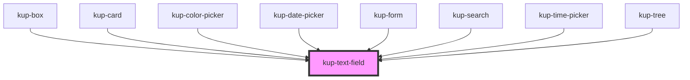

# kup-text-field

<!-- Auto Generated Below -->

## Properties

| Property                 | Attribute                    | Description                                                                                                                                                                | Type      | Default  |
| ------------------------ | ---------------------------- | -------------------------------------------------------------------------------------------------------------------------------------------------------------------------- | --------- | -------- |
| `customStyle`            | `custom-style`               | Custom style of the component.                                                                                                                                             | `string`  | `''`     |
| `disabled`               | `disabled`                   | When set to true, the component is disabled.                                                                                                                               | `boolean` | `false`  |
| `emitSubmitEventOnEnter` | `emit-submit-event-on-enter` | When the text field is part of the autocomplete component and the list is opened, enter key selects the item and doesn't submit.                                           | `boolean` | `true`   |
| `fullWidth`              | `full-width`                 | When set to true, the component will be rendered at full width.                                                                                                            | `boolean` | `false`  |
| `helper`                 | `helper`                     | When set, its content will be shown as a help text below the field.                                                                                                        | `string`  | `null`   |
| `helperWhenFocused`      | `helper-when-focused`        | When set, the helper will be shown only when the field is focused.                                                                                                         | `boolean` | `false`  |
| `icon`                   | `icon`                       | When set, the text-field will show this icon.                                                                                                                              | `string`  | `null`   |
| `initialValue`           | `initial-value`              | Sets the initial value of the component                                                                                                                                    | `string`  | `''`     |
| `inputType`              | `input-type`                 | The HTML type of the input element. It has no effect on text areas.                                                                                                        | `string`  | `'text'` |
| `isClearable`            | `is-clearable`               | Enables a clear trailing icon.                                                                                                                                             | `boolean` | `false`  |
| `label`                  | `label`                      | When set, its content will be shown as a label.                                                                                                                            | `string`  | `null`   |
| `leadingLabel`           | `leading-label`              | When set to true, the label will be on the left of the component.                                                                                                          | `boolean` | `false`  |
| `max`                    | `max`                        | The HTML max attribute specifies the maximum value for the input element. Works with the following input types: number, range, date, datetime-local, month, time and week. | `number`  | `null`   |
| `maxLength`              | `max-length`                 | When set, the helper will display a character counter.                                                                                                                     | `number`  | `null`   |
| `min`                    | `min`                        | The HTML min attribute specifies the minimum value for the input element. Works with the following input types: number, range, date, datetime-local, month, time and week. | `number`  | `null`   |
| `outlined`               | `outlined`                   | When set to true, the component will be rendered as an outlined field.                                                                                                     | `boolean` | `false`  |
| `readOnly`               | `read-only`                  | Sets the component to read only state, making it not editable, but interactable. Used in combobox component when it behaves as a select.                                   | `boolean` | `false`  |
| `step`                   | `step`                       | The HTML step of the input element. It has effect only with number input type.                                                                                             | `number`  | `null`   |
| `textArea`               | `text-area`                  | When set to true, the component will be rendered as a textarea.                                                                                                            | `boolean` | `false`  |
| `trailingIcon`           | `trailing-icon`              | When set, the icon will be shown after the text.                                                                                                                           | `boolean` | `false`  |
| `trailingLabel`          | `trailing-label`             | When set to true, the label will be on the right of the component.                                                                                                         | `boolean` | `false`  |

## Events

| Event                        | Description                                            | Type                                       |
| ---------------------------- | ------------------------------------------------------ | ------------------------------------------ |
| `kupTextFieldBlur`           | Triggered when the input element loses focus.          | `CustomEvent<{ id: any; value: string; }>` |
| `kupTextFieldChange`         | Triggered when the input element changes.              | `CustomEvent<{ id: any; value: string; }>` |
| `kupTextFieldClearIconClick` | Triggered when the text field's clear icon is clicked. | `CustomEvent<{ id: any; }>`                |
| `kupTextFieldClick`          | Triggered when the input element is clicked.           | `CustomEvent<{ id: any; value: string; }>` |
| `kupTextFieldFocus`          | Triggered when the input element gets focused.         | `CustomEvent<{ id: any; value: string; }>` |
| `kupTextFieldIconClick`      | Triggered when the text field's icon is clicked.       | `CustomEvent<{ id: any; value: string; }>` |
| `kupTextFieldInput`          | Triggered when the input element receives an input.    | `CustomEvent<{ id: any; value: string; }>` |
| `kupTextFieldSubmit`         | Triggered when the Enter key is pressed.               | `CustomEvent<{ id: any; value: string; }>` |

## Methods

### `getProps(descriptions?: boolean) => Promise<GenericObject>`

Used to retrieve component's props values.

#### Returns

Type: `Promise<GenericObject>`

### `getValue() => Promise<string>`

Returns the component's internal value.

#### Returns

Type: `Promise<string>`

### `refresh() => Promise<void>`

This method is used to trigger a new render of the component.

#### Returns

Type: `Promise<void>`

### `setFocus() => Promise<void>`

Focuses the input element.

#### Returns

Type: `Promise<void>`

### `setValue(value: string) => Promise<void>`

Sets the internal value of the component.

#### Returns

Type: `Promise<void>`

## Dependencies

### Used by

 - [kup-box](../kup-box)
 - [kup-card](../kup-card)
 - [kup-color-picker](../kup-color-picker)
 - [kup-date-picker](../kup-date-picker)
 - [kup-form](../kup-form)
 - [kup-search](../kup-search)
 - [kup-time-picker](../kup-time-picker)
 - [kup-tree](../kup-tree)

### Graph

----------------------------------------------

*Built with [StencilJS](https://stenciljs.com/)*
