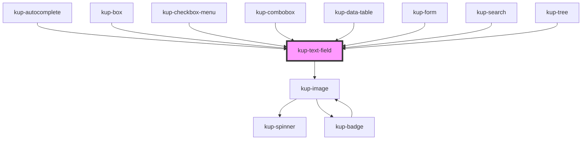

# kup-text-field

<!-- Auto Generated Below -->

## Properties

| Property                 | Attribute                    | Description                                                                                                                              | Type      | Default     |
| ------------------------ | ---------------------------- | ---------------------------------------------------------------------------------------------------------------------------------------- | --------- | ----------- |
| `customStyle`            | `custom-style`               | Custom style of the component. For more information: https://ketchup.smeup.com/ketchup-showcase/#/customization                          | `string`  | `undefined` |
| `disabled`               | `disabled`                   | Defaults at false. When set to true, the component is disabled.                                                                          | `boolean` | `false`     |
| `emitSubmitEventOnEnter` | `emit-submit-event-on-enter` | When the text field is part of the autocomplete component and the list is opened, enter key selects the item and doesn't submit.         | `boolean` | `true`      |
| `forceFocus`             | `force-focus`                | Defaults at false. When set to true, the component will be focused.                                                                      | `boolean` | `false`     |
| `fullHeight`             | `full-height`                | Defaults at false. When set to true, the component will be rendered at full height.                                                      | `boolean` | `false`     |
| `fullWidth`              | `full-width`                 | Defaults at false. When set to true, the component will be rendered at full width.                                                       | `boolean` | `false`     |
| `helper`                 | `helper`                     | Defaults at null. When set, its content will be shown as a help text below the field.                                                    | `string`  | `null`      |
| `helperWhenFocused`      | `helper-when-focused`        | Defaults at false. When set, the helper will be shown only when the field is focused.                                                    | `boolean` | `false`     |
| `icon`                   | `icon`                       | Defaults at null. When set, the text-field will show this icon.                                                                          | `string`  | `null`      |
| `initialValue`           | `initial-value`              | Sets the initial value of the component                                                                                                  | `string`  | `''`        |
| `inputType`              | `input-type`                 | The HTML type of the input element. It has no effect on text areas.                                                                      | `string`  | `'text'`    |
| `isClearable`            | `is-clearable`               | Enables a clear trailing icon.                                                                                                           | `boolean` | `false`     |
| `label`                  | `label`                      | Defaults at null. When set, its content will be shown as a label.                                                                        | `string`  | `null`      |
| `leadingLabel`           | `leading-label`              | Defaults at false. When set to true, the label will be on the left of the component.                                                     | `boolean` | `false`     |
| `maxLength`              | `max-length`                 | Defaults at null. When set, the helper will display a character counter.                                                                 | `number`  | `null`      |
| `outlined`               | `outlined`                   | Defaults at false. When set to true, the component will be rendered as an outlined field.                                                | `boolean` | `false`     |
| `readOnly`               | `read-only`                  | Sets the component to read only state, making it not editable, but interactable. Used in combobox component when it behaves as a select. | `boolean` | `false`     |
| `shaped`                 | `shaped`                     | Defaults at false. When set to true, the button will be rendered with shaped edges.                                                      | `boolean` | `false`     |
| `textArea`               | `text-area`                  | Defaults at false. When set to true, the component will be rendered as a textarea.                                                       | `boolean` | `false`     |
| `trailingIcon`           | `trailing-icon`              | Defaults at null. When set, the icon will be shown after the text.                                                                       | `boolean` | `false`     |
| `trailingLabel`          | `trailing-label`             | Defaults at false. When set to true, the label will be on the right of the component.                                                    | `boolean` | `false`     |

## Events

| Event                        | Description                                    | Type                                       |
| ---------------------------- | ---------------------------------------------- | ------------------------------------------ |
| `kupTextFieldBlur`           |                                                | `CustomEvent<{ id: any; value: string; }>` |
| `kupTextFieldChange`         |                                                | `CustomEvent<{ id: any; value: string; }>` |
| `kupTextFieldClearIconClick` |                                                | `CustomEvent<{ id: any; }>`                |
| `kupTextFieldClick`          |                                                | `CustomEvent<{ id: any; value: string; }>` |
| `kupTextFieldFocus`          |                                                | `CustomEvent<{ id: any; value: string; }>` |
| `kupTextFieldIconClick`      |                                                | `CustomEvent<{ id: any; value: string; }>` |
| `kupTextFieldInput`          |                                                | `CustomEvent<{ id: any; value: string; }>` |
| `kupTextFieldSubmit`         | When a keydown enter event occurs it generates | `CustomEvent<{ id: any; value: string; }>` |

## Methods

### `changeValue(newValue: string, emitEvent?: boolean) => Promise<boolean>`

Imperatively sets a new value of the input.

#### Returns

Type: `Promise<boolean>`

### `refreshCustomStyle(customStyleTheme: string) => Promise<void>`

#### Returns

Type: `Promise<void>`

## Dependencies

### Used by

 - [kup-autocomplete](../kup-autocomplete)
 - [kup-box](../kup-box)
 - [kup-checkbox-menu](../kup-checkbox-menu)
 - [kup-combobox](../kup-combobox)
 - [kup-data-table](../kup-data-table)
 - [kup-form](../kup-form)
 - [kup-search](../kup-search)
 - [kup-tree](../kup-tree)

### Depends on

- [kup-image](../kup-image)

### Graph

----------------------------------------------

*Built with [StencilJS](https://stenciljs.com/)*
