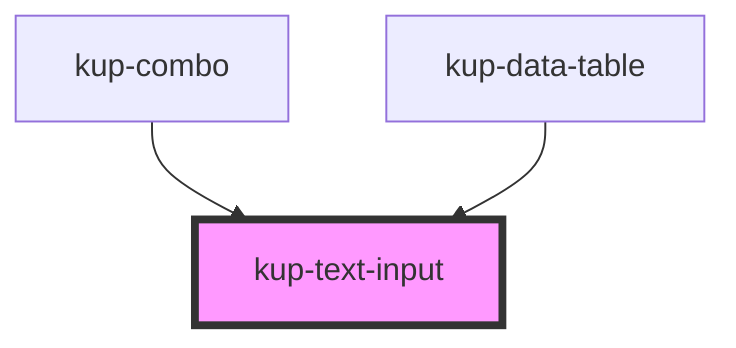

# kup-text-input

<!-- Auto Generated Below -->

## Properties

| Property       | Attribute       | Description                                                                                                                                                                                 | Type            | Default     |
| -------------- | --------------- | ------------------------------------------------------------------------------------------------------------------------------------------------------------------------------------------- | --------------- | ----------- |
| `debounce`     | `debounce`      | Set the amount of time, in milliseconds, to wait to trigger the `ketchupTextInputUpdated` event after each keystroke.                                                                       | `number`        | `400`       |
| `initialValue` | `initial-value` | Marks the field as clearable, allowing an icon to delete its content                                                                                                                        | `string`        | `''`        |
| `inputType`    | `input-type`    | Specify the type of input. Allowed values: password, text.                                                                                                                                  | `string`        | `'text'`    |
| `isClearable`  | `is-clearable`  | Marks the field as clearable, allowing an icon to delete its content                                                                                                                        | `boolean`       | `false`     |
| `label`        | `label`         | Label to describe the text-input clear button group                                                                                                                                         | `string`        | `''`        |
| `maxLength`    | `max-length`    | The max length of the text field. Default value copied from here: https://www.w3schools.com/tags/att_input_maxlength.asp                                                                    | `number`        | `524288`    |
| `obj`          | --              | A generic object which can be passed to the component. Once this object is set, it will always be returned inside the info field of the ketchupTextInputUpdated and ketchupTextInputSubmit. | `GenericObject` | `undefined` |
| `placeholder`  | `placeholder`   | text for input placeholder                                                                                                                                                                  | `string`        | `''`        |

## Events

| Event                     | Description                                    | Type                                                  |
| ------------------------- | ---------------------------------------------- | ----------------------------------------------------- |
| `ketchupTextInputBlurred` | When text field loses focus (blur)             | `CustomEvent<KupPayloadEvent<string, GenericObject>>` |
| `ketchupTextInputFocused` | When the text input gains focus                | `CustomEvent<KupPayloadEvent<string, GenericObject>>` |
| `ketchupTextInputSubmit`  | When a keydown enter event occurs it generates | `CustomEvent<KupPayloadEvent<string, GenericObject>>` |
| `ketchupTextInputUpdated` | When the input text value gets updated         | `CustomEvent<KupPayloadEvent<string, GenericObject>>` |

## Methods

### `triggerFocus() => Promise<void>`

Triggers the focus event on the input text

#### Returns

Type: `Promise<void>`

## CSS Custom Properties

| Name                                                          | Description                                     |
| ------------------------------------------------------------- | ----------------------------------------------- |
| `--int_background-color, --kup-text-input_background-color`   | Sets the background color of the input text     |
| `--int_border-color, --kup-text-input_border-color`           | Set normal border color of the input            |
| `--int_border-color--selected, --kup-text-input_border-color` | Set color of the border when focused or hovered |
| `--int_color, --kup-text-input_color`                         | Set color of text                               |
| `--int_font-size, --kup-text-input_font-size`                 | Set height of the font and the svg icon         |
| `--int_icon-color, --kup-text-input_icon-color`               | Set icon color                                  |
| `--int_icon-color--hover, --kup-text-input_icon-color--hover` | Set icon color when hovered                     |
| `--int_placeholder-color, --kup-text-input_placeholder-color` | Set placeholder text color                      |
| `--int_tr-duration, --kup-text-input_transition-duration`     | Set all transitions duration                    |

## Dependencies

### Used by

 - [kup-combo](..\kup-combo)
 - [kup-data-table](..\kup-data-table)

### Graph

----------------------------------------------

*Built with [StencilJS](https://stenciljs.com/)*
