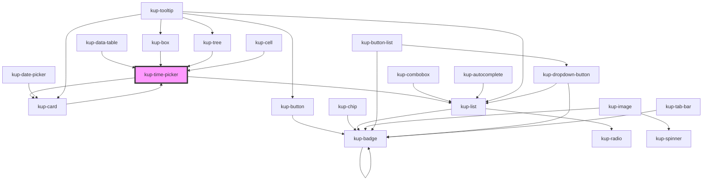

# kup-date-picker

<!-- Auto Generated Below -->

## Properties

| Property          | Attribute           | Description                                                     | Type      | Default |
| ----------------- | ------------------- | --------------------------------------------------------------- | --------- | ------- |
| `clockVariant`    | `clock-variant`     | When set to true, the drop down menu will display a clock.      | `boolean` | `true`  |
| `customStyle`     | `custom-style`      | Custom style of the component.                                  | `string`  | `''`    |
| `data`            | --                  | Props of the sub-components (time input text field)             | `Object`  | `{}`    |
| `disabled`        | `disabled`          | Defaults at false. When set to true, the component is disabled. | `boolean` | `false` |
| `initialValue`    | `initial-value`     | Sets the initial value of the component.                        | `string`  | `''`    |
| `manageSeconds`   | `manage-seconds`    | Manage seconds.                                                 | `boolean` | `false` |
| `timeMinutesStep` | `time-minutes-step` | Minutes step.                                                   | `number`  | `10`    |

## Events

| Event                            | Description | Type                                     |
| -------------------------------- | ----------- | ---------------------------------------- |
| `kup-timepicker-blur`            |             | `CustomEvent<KupTimePickerEventPayload>` |
| `kup-timepicker-change`          |             | `CustomEvent<KupTimePickerEventPayload>` |
| `kup-timepicker-cleariconclick`  |             | `CustomEvent<KupEventPayload>`           |
| `kup-timepicker-click`           |             | `CustomEvent<KupTimePickerEventPayload>` |
| `kup-timepicker-focus`           |             | `CustomEvent<KupTimePickerEventPayload>` |
| `kup-timepicker-iconclick`       |             | `CustomEvent<KupTimePickerEventPayload>` |
| `kup-timepicker-input`           |             | `CustomEvent<KupTimePickerEventPayload>` |
| `kup-timepicker-itemclick`       |             | `CustomEvent<KupTimePickerEventPayload>` |
| `kup-timepicker-textfieldsubmit` |             | `CustomEvent<KupTimePickerEventPayload>` |

## Methods

### `getProps(descriptions?: boolean) => Promise<GenericObject>`

Used to retrieve component's props values.

#### Returns

Type: `Promise<GenericObject>`

List of props as object, each key will be a prop.

### `getValue() => Promise<string>`

Returns the component's internal value.

#### Returns

Type: `Promise<string>`

### `refresh() => Promise<void>`

This method is used to trigger a new render of the component.

#### Returns

Type: `Promise<void>`

### `setFocus() => Promise<void>`

Focuses the input element.

#### Returns

Type: `Promise<void>`

### `setProps(props: GenericObject) => Promise<void>`

Sets the props to the component.

#### Returns

Type: `Promise<void>`

### `setValue(value: string) => Promise<void>`

Sets the internal value of the component.

#### Returns

Type: `Promise<void>`

## Dependencies

### Used by

 - [kup-box](../kup-box)
 - [kup-card](../kup-card)
 - [kup-cell](../kup-cell)
 - [kup-data-table](../kup-data-table)
 - [kup-tree](../kup-tree)

### Depends on

- [kup-card](../kup-card)
- [kup-list](../kup-list)

### Graph

----------------------------------------------

*Built with [StencilJS](https://stenciljs.com/)*
