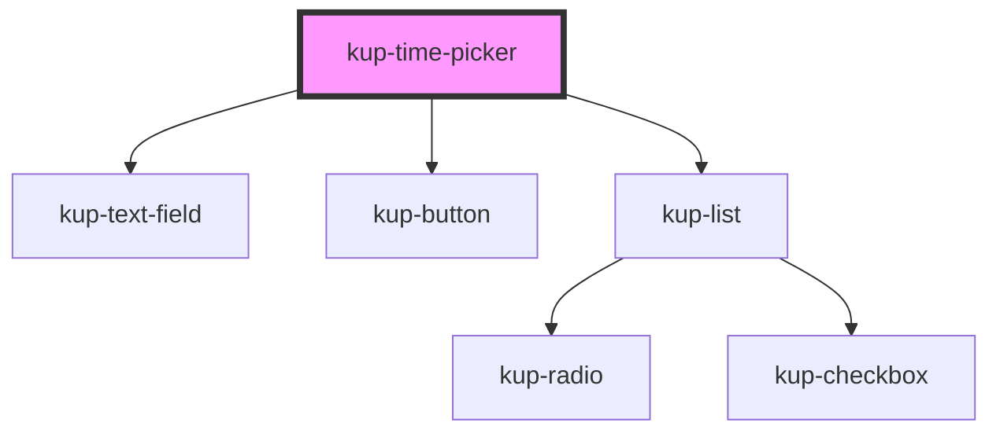

# kup-date-picker

<!-- Auto Generated Below -->

## Properties

| Property          | Attribute           | Description                                                                                                     | Type      | Default     |
| ----------------- | ------------------- | --------------------------------------------------------------------------------------------------------------- | --------- | ----------- |
| `clockVariant`    | `clock-variant`     | When set to true, the drop down menu will display a clock.                                                      | `boolean` | `true`      |
| `customStyle`     | `custom-style`      | Custom style of the component. For more information: https://ketchup.smeup.com/ketchup-showcase/#/customization | `string`  | `undefined` |
| `data`            | --                  | Props of the sub-components (time input text field)                                                             | `Object`  | `{}`        |
| `disabled`        | `disabled`          | Defaults at false. When set to true, the component is disabled.                                                 | `boolean` | `false`     |
| `initialValue`    | `initial-value`     | Sets the initial value of the component                                                                         | `string`  | `''`        |
| `manageSeconds`   | `manage-seconds`    | Manage seconds                                                                                                  | `boolean` | `false`     |
| `timeMinutesStep` | `time-minutes-step` | Minutes step                                                                                                    | `number`  | `10`        |

## Events

| Event                          | Description | Type                                                        |
| ------------------------------ | ----------- | ----------------------------------------------------------- |
| `kupTimePickerBlur`            |             | `CustomEvent<{ value: any; source: PICKER_SOURCE_EVENT; }>` |
| `kupTimePickerChange`          |             | `CustomEvent<{ value: any; source: PICKER_SOURCE_EVENT; }>` |
| `kupTimePickerClick`           |             | `CustomEvent<{ value: any; source: PICKER_SOURCE_EVENT; }>` |
| `kupTimePickerFocus`           |             | `CustomEvent<{ value: any; source: PICKER_SOURCE_EVENT; }>` |
| `kupTimePickerIconClick`       |             | `CustomEvent<{ value: any; source: PICKER_SOURCE_EVENT; }>` |
| `kupTimePickerInput`           |             | `CustomEvent<{ value: any; source: PICKER_SOURCE_EVENT; }>` |
| `kupTimePickerItemClick`       |             | `CustomEvent<{ value: any; source: PICKER_SOURCE_EVENT; }>` |
| `kupTimePickerTextFieldSubmit` |             | `CustomEvent<{ value: any; source: PICKER_SOURCE_EVENT; }>` |

## Methods

### `getValue() => Promise<string>`

#### Returns

Type: `Promise<string>`

### `refreshCustomStyle(customStyleTheme: string) => Promise<void>`

#### Returns

Type: `Promise<void>`

### `setFocus() => Promise<void>`

#### Returns

Type: `Promise<void>`

### `setValue(value: string) => Promise<void>`

#### Returns

Type: `Promise<void>`

## Dependencies

### Depends on

- [kup-text-field](../kup-text-field)
- [kup-button](../kup-button)
- [kup-list](../kup-list)

### Graph

----------------------------------------------

*Built with [StencilJS](https://stenciljs.com/)*
