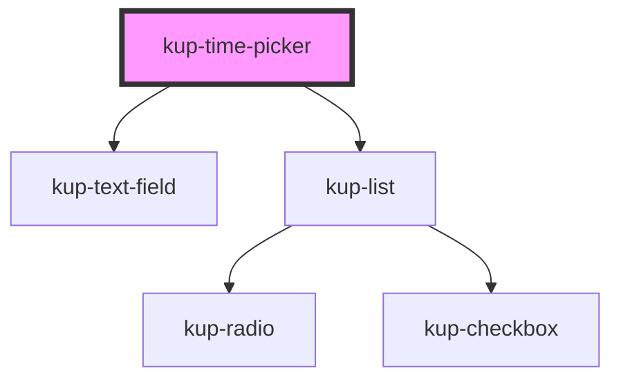

# kup-date-picker

<!-- Auto Generated Below -->

## Properties

| Property            | Attribute            | Description                                                                                                     | Type     | Default     |
| ------------------- | -------------------- | --------------------------------------------------------------------------------------------------------------- | -------- | ----------- |
| `customStyle`       | `custom-style`       | Custom style of the component. For more information: https://ketchup.smeup.com/ketchup-showcase/#/customization | `string` | `undefined` |
| `timeInitialValue`  | `time-initial-value` | The initial value of the time picker.                                                                           | `string` | `''`        |
| `timeMinutesStep`   | `time-minutes-step`  | Minutes step                                                                                                    | `number` | `10`        |
| `timeTextfieldData` | --                   | Props of the time text field.                                                                                   | `Object` | `{}`        |

## Events

| Event                          | Description | Type                                                        |
| ------------------------------ | ----------- | ----------------------------------------------------------- |
| `kupTimePickerBlur`            |             | `CustomEvent<{ value: any; source: PICKER_SOURCE_EVENT; }>` |
| `kupTimePickerChange`          |             | `CustomEvent<{ value: any; source: PICKER_SOURCE_EVENT; }>` |
| `kupTimePickerClick`           |             | `CustomEvent<{ value: any; source: PICKER_SOURCE_EVENT; }>` |
| `kupTimePickerFocus`           |             | `CustomEvent<{ value: any; source: PICKER_SOURCE_EVENT; }>` |
| `kupTimePickerIconClick`       |             | `CustomEvent<{ value: any; source: PICKER_SOURCE_EVENT; }>` |
| `kupTimePickerInput`           |             | `CustomEvent<{ value: any; source: PICKER_SOURCE_EVENT; }>` |
| `kupTimePickerItemClick`       |             | `CustomEvent<{ value: any; source: PICKER_SOURCE_EVENT; }>` |
| `kupTimePickerTextFieldSubmit` |             | `CustomEvent<{ value: any; source: PICKER_SOURCE_EVENT; }>` |

## Methods

### `refreshCustomStyle(customStyleTheme: string) => Promise<void>`

#### Returns

Type: `Promise<void>`

## Dependencies

### Depends on

- [kup-text-field](../kup-text-field)
- [kup-list](../kup-list)

### Graph

----------------------------------------------

*Built with [StencilJS](https://stenciljs.com/)*
