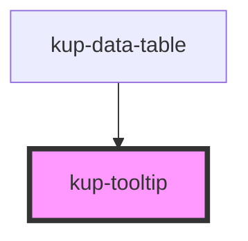

# kup-tooltip

<!-- Auto Generated Below -->

## Properties

| Property     | Attribute | Description                      | Type          | Default     |
| ------------ | --------- | -------------------------------- | ------------- | ----------- |
| `data`       | --        | Data for top section             | `TooltipData` | `undefined` |
| `detailData` | --        | Data for the detail              | `DataTable`   | `undefined` |
| `layout`     | `layout`  | Layout used to display the items | `string`      | `'1'`       |

## Events

| Event                  | Description | Type               |
| ---------------------- | ----------- | ------------------ |
| `kupTooltipLoadData`   |             | `CustomEvent<any>` |
| `kupTooltipLoadDetail` |             | `CustomEvent<any>` |

## Dependencies

### Used by

 - [kup-data-table](..\kup-data-table)

### Graph

----------------------------------------------

*Built with [StencilJS](https://stenciljs.com/)*
