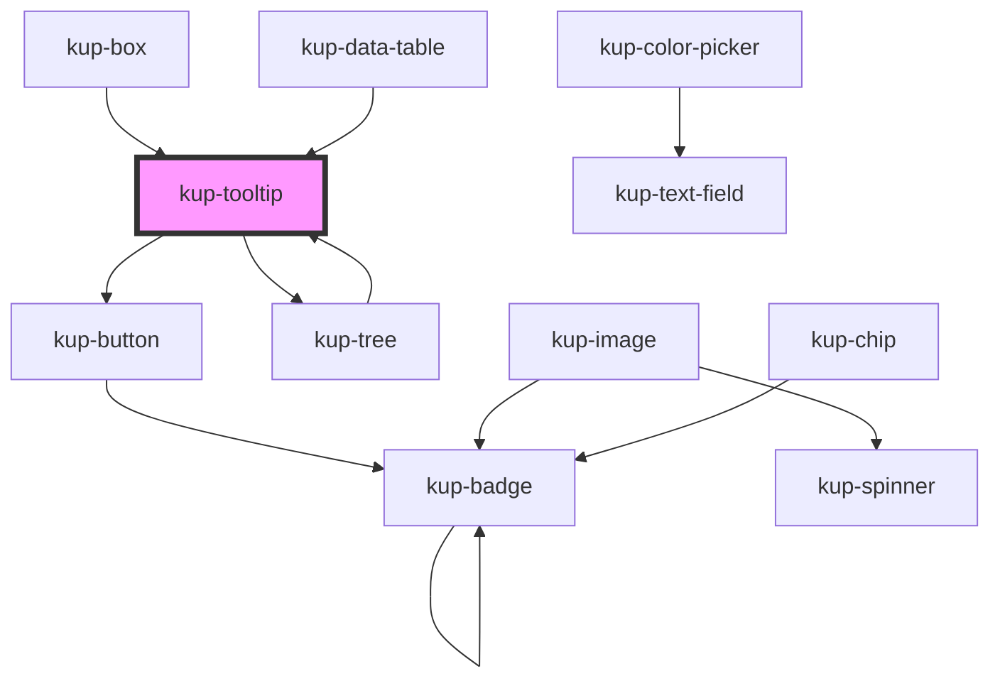

# kup-tooltip

<!-- Auto Generated Below -->

## Properties

| Property        | Attribute        | Description                      | Type                   | Default     |
| --------------- | ---------------- | -------------------------------- | ---------------------- | ----------- |
| `cellOptions`   | --               | Data for cell options            | `TooltipCellOptions`   | `undefined` |
| `data`          | --               | Data for top section             | `TooltipData`          | `undefined` |
| `detailData`    | --               | Data for the detail              | `TooltipDetailData`    | `undefined` |
| `detailTimeout` | `detail-timeout` | Timeout for loadDetail           | `number`               | `800`       |
| `layout`        | `layout`         | Layout used to display the items | `string`               | `'1'`       |
| `loadTimeout`   | `load-timeout`   | Timeout for tooltip              | `number`               | `1000`      |
| `relatedObject` | --               | Container element for tooltip    | `TooltipRelatedObject` | `undefined` |

## Events

| Event                       | Description | Type                                                                         |
| --------------------------- | ----------- | ---------------------------------------------------------------------------- |
| `kupActionCommandClicked`   |             | `CustomEvent<{ actionCommand: TooltipAction; }>`                             |
| `kupDefaultActionClicked`   |             | `CustomEvent<{ obj: TooltipObject; }>`                                       |
| `kupDefaultOptionClicked`   |             | `CustomEvent<{ obj: TooltipObject; }>`                                       |
| `kupDefaultPreviewClicked`  |             | `CustomEvent<{ obj: TooltipObject; }>`                                       |
| `kupTooltipLoadCellOptions` |             | `CustomEvent<{ relatedObject: TooltipRelatedObject; tooltip: KupTooltip; }>` |
| `kupTooltipLoadData`        |             | `CustomEvent<{ relatedObject: TooltipRelatedObject; tooltip: KupTooltip; }>` |
| `kupTooltipLoadDetail`      |             | `CustomEvent<{ relatedObject: TooltipRelatedObject; tooltip: KupTooltip; }>` |

## Methods

### `setTooltipInfo(relatedObject: TooltipRelatedObject) => Promise<void>`

#### Returns

Type: `Promise<void>`

### `unsetTooltipInfo() => Promise<void>`

#### Returns

Type: `Promise<void>`

## Dependencies

### Used by

 - [kup-box](../kup-box)
 - [kup-data-table](../kup-data-table)
 - [kup-tree](../kup-tree)

### Depends on

- [kup-button](../kup-button)
- [kup-tree](../kup-tree)

### Graph

----------------------------------------------

*Built with [StencilJS](https://stenciljs.com/)*
