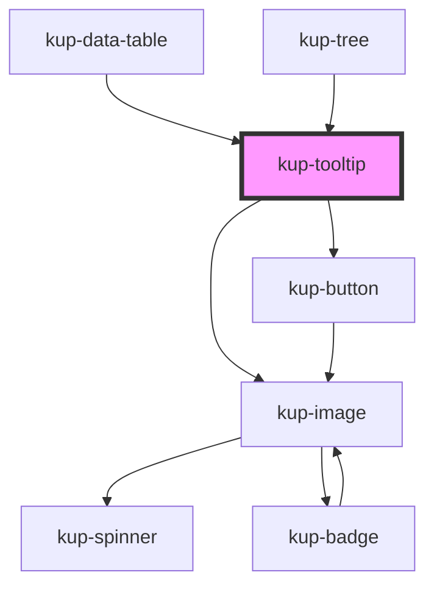

# kup-tooltip

<!-- Auto Generated Below -->

## Properties

| Property        | Attribute        | Description                      | Type                | Default     |
| --------------- | ---------------- | -------------------------------- | ------------------- | ----------- |
| `data`          | --               | Data for top section             | `TooltipData`       | `undefined` |
| `detailData`    | --               | Data for the detail              | `TooltipDetailData` | `undefined` |
| `detailTimeout` | `detail-timeout` | Timeout for loadDetail           | `number`            | `800`       |
| `layout`        | `layout`         | Layout used to display the items | `string`            | `'1'`       |
| `loadTimeout`   | `load-timeout`   | Timeout for tooltip              | `number`            | `1000`      |

## Events

| Event                     | Description | Type                                             |
| ------------------------- | ----------- | ------------------------------------------------ |
| `kupActionCommandClicked` |             | `CustomEvent<{ actionCommand: TooltipAction; }>` |
| `kupDefaultActionClicked` |             | `CustomEvent<{ obj: TooltipObject; }>`           |
| `kupDefaultOptionClicked` |             | `CustomEvent<{ obj: TooltipObject; }>`           |
| `kupTooltipLoadData`      |             | `CustomEvent<any>`                               |
| `kupTooltipLoadDetail`    |             | `CustomEvent<any>`                               |

## Dependencies

### Used by

 - [kup-data-table](../kup-data-table)
 - [kup-tree](../kup-tree)

### Depends on

- [kup-button](../kup-button)
- [kup-image](../kup-image)

### Graph

----------------------------------------------

*Built with [StencilJS](https://stenciljs.com/)*
