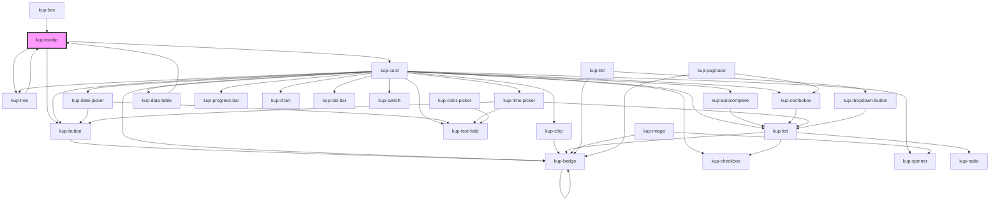

# kup-tooltip

<!-- Auto Generated Below -->

## Properties

| Property        | Attribute        | Description                      | Type                   | Default     |
| --------------- | ---------------- | -------------------------------- | ---------------------- | ----------- |
| `cellOptions`   | --               | Data for cell options            | `TooltipCellOptions`   | `undefined` |
| `data`          | --               | Data for top section             | `TooltipData`          | `undefined` |
| `detailData`    | --               | Data for the detail              | `TooltipDetailData`    | `undefined` |
| `detailTimeout` | `detail-timeout` | Timeout for loadDetail           | `number`               | `800`       |
| `layout`        | `layout`         | Layout used to display the items | `string`               | `'1'`       |
| `loadTimeout`   | `load-timeout`   | Timeout for tooltip              | `number`               | `1000`      |
| `owner`         | `owner`          | Owner of this tooltip            | `string`               | `'not-set'` |
| `relatedObject` | --               | Container element for tooltip    | `TooltipRelatedObject` | `undefined` |

## Events

| Event                                | Description                                     | Type                                                                                                                                                         |
| ------------------------------------ | ----------------------------------------------- | ------------------------------------------------------------------------------------------------------------------------------------------------------------ |
| `kupActionCommandClicked`            |                                                 | `CustomEvent<{ actionCommand: TooltipAction; relatedObject: TooltipRelatedObject; }>`                                                                        |
| `kupDefaultActionClicked`            |                                                 | `CustomEvent<{ obj: TooltipObject; }>`                                                                                                                       |
| `kupDefaultOptionClicked`            |                                                 | `CustomEvent<{ obj: TooltipObject; }>`                                                                                                                       |
| `kupDefaultPreviewClicked`           |                                                 | `CustomEvent<{ obj: TooltipObject; }>`                                                                                                                       |
| `kupTooltipLoadCellOptions`          |                                                 | `CustomEvent<{ relatedObject: TooltipRelatedObject; tooltip: KupTooltip; }>`                                                                                 |
| `kupTooltipLoadData`                 |                                                 | `CustomEvent<{ relatedObject: TooltipRelatedObject; tooltip: KupTooltip; }>`                                                                                 |
| `kupTooltipLoadDetail`               |                                                 | `CustomEvent<{ relatedObject: TooltipRelatedObject; tooltip: KupTooltip; }>`                                                                                 |
| `kupTooltipTreeDynamicMassExpansion` |                                                 | `CustomEvent<{ treeNodePath?: TreeNodePath; treeNode?: TreeNode; expandAll?: boolean; }>`                                                                    |
| `kupTooltipTreeNodeButtonClicked`    |                                                 | `CustomEvent<{ treeNodePath: TreeNodePath; treeNode: TreeNode; column: Column; columnName: string; auto: boolean; tree: KupTree; }>`                         |
| `kupTooltipTreeNodeDblClick`         |                                                 | `CustomEvent<{ treeNodePath: TreeNodePath; treeNode: TreeNode; }>`                                                                                           |
| `kupTooltipTreeNodeExpand`           |                                                 | `CustomEvent<{ treeNodePath: TreeNodePath; treeNode: TreeNode; usesDynamicExpansion?: boolean; dynamicExpansionRequireChildren?: boolean; tree: KupTree; }>` |
| `kupTooltipTreeNodeSelected`         | Fired when a node of the tree has been selected | `CustomEvent<{ treeNodePath: TreeNodePath; treeNode: TreeNode; columnName: string; auto: boolean; tree: KupTree; }>`                                         |

## Methods

### `getProps(descriptions?: boolean) => Promise<GenericObject>`

Used to retrieve component's props values.

#### Returns

Type: `Promise<GenericObject>`

### `refresh() => Promise<void>`

This method is used to trigger a new render of the component.

#### Returns

Type: `Promise<void>`

### `setTooltipInfo(relatedObject: TooltipRelatedObject) => Promise<void>`

#### Returns

Type: `Promise<void>`

### `unsetTooltipInfo() => Promise<void>`

#### Returns

Type: `Promise<void>`

## Dependencies

### Used by

 - [kup-box](../kup-box)
 - [kup-data-table](../kup-data-table)
 - [kup-tree](../kup-tree)

### Depends on

- [kup-button](../kup-button)
- [kup-card](../kup-card)
- [kup-tree](../kup-tree)

### Graph

----------------------------------------------

*Built with [StencilJS](https://stenciljs.com/)*
