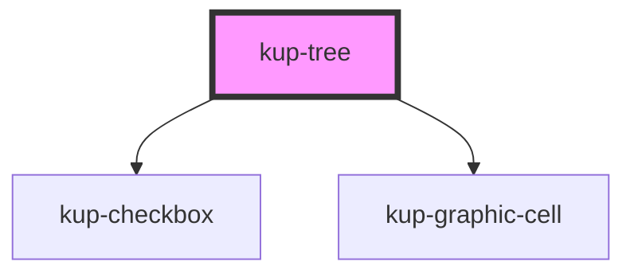

# kup-tree

## Status

Work in progress

## Glossary

A collection of terms used for this component.

**TreeNode**: Any node of the tree data. When rendered, it corresponds to a table row.

**TreeNodeCell**: The cell containing the indentation, open/close icon, TreeNode icon and TreeNode information
(rendered both when the tree is hiding or showing the columns).

## Possible future development

### Keyboard support
Currently browsing, opening or closing items by using the keyboard controls is not supported.

Ideally it can be achieved by using `tabindex` for navigation and a check on the `spacebar` and `enter` keys to
open or close the TreeNodes. 

<!-- Auto Generated Below -->

## Properties

| Property                   | Attribute                | Description                                                                                                                                                                                                                                                                                                                                                                                                                                                                                                                                                                                                                                                                                   | Type                                                                          | Default     |
| -------------------------- | ------------------------ | --------------------------------------------------------------------------------------------------------------------------------------------------------------------------------------------------------------------------------------------------------------------------------------------------------------------------------------------------------------------------------------------------------------------------------------------------------------------------------------------------------------------------------------------------------------------------------------------------------------------------------------------------------------------------------------------- | ----------------------------------------------------------------------------- | ----------- |
| `columns`                  | --                       | The columns of the tree when tree visualization is active                                                                                                                                                                                                                                                                                                                                                                                                                                                                                                                                                                                                                                     | `Column[]`                                                                    | `undefined` |
| `data`                     | --                       | The json data used to populate the tree view: the basic, always visible tree nodes.                                                                                                                                                                                                                                                                                                                                                                                                                                                                                                                                                                                                           | `TreeNode[]`                                                                  | `[]`        |
| `dynamicExpansionCallback` | --                       | Function that gets invoked when a new set of nodes must be loaded as children of a node. Used in combination with showObjectNavigation.  When useDynamicExpansion is set, the tree component will have two different behaviors depending on the value of this prop. 1 - If this prop is set to null, no callback to download data is available:     the component will emit an event requiring the parent to load the children of the given node. 2 - If this prop is set to have a callback, then the component will automatically make requests to load children of     a given node. After the load has been completed, a different event will be fired to alert the parent of the change. | `(treeNodeToExpand: TreeNode, treeNodePath: number[]) => Promise<TreeNode[]>` | `undefined` |
| `expanded`                 | `expanded`               | Flag: the nodes of the whole tree must be already expanded upon loading. Disabled nodes do NOT get expanded.                                                                                                                                                                                                                                                                                                                                                                                                                                                                                                                                                                                  | `boolean`                                                                     | `false`     |
| `selectedNode`             | --                       | An array of integers containing the path to a selected child.\ Groups up the properties SelFirst, SelItem, SelName.                                                                                                                                                                                                                                                                                                                                                                                                                                                                                                                                                                           | `number[]`                                                                    | `[]`        |
| `showColumns`              | `show-columns`           | Shows the tree data as a table.                                                                                                                                                                                                                                                                                                                                                                                                                                                                                                                                                                                                                                                               | `boolean`                                                                     | `false`     |
| `showHeader`               | `show-header`            | Flag: shows the header of the tree when the tree is displayed as a table.                                                                                                                                                                                                                                                                                                                                                                                                                                                                                                                                                                                                                     | `boolean`                                                                     | `false`     |
| `showIcons`                | `show-icons`             | Show the icons of the various nodes of the tree.                                                                                                                                                                                                                                                                                                                                                                                                                                                                                                                                                                                                                                              | `boolean`                                                                     | `true`      |
| `showObjectNavigation`     | `show-object-navigation` | When a node has options in its data and is on mouse over state while this prop is true, the node must shows the cog wheel to trigger object navigation upon click.  This will generate an event to inform the navigation object has been activated.                                                                                                                                                                                                                                                                                                                                                                                                                                           | `boolean`                                                                     | `false`     |
| `useDynamicExpansion`      | `use-dynamic-expansion`  | When the component must use the dynamic expansion feature to open its nodes, it means that not all the nodes of the tree have been passed inside the data property.  Therefore, when expanding a node, the tree must emit an event (or run a given callback) and wait for the child nodes to be downloaded from the server.  For more information:                                                                                                                                                                                                                                                                                                                                            | `boolean`                                                                     | `false`     |

## Events

| Event                 | Description                                                                                                                                                                 | Type                                                                                                                                      |
| --------------------- | --------------------------------------------------------------------------------------------------------------------------------------------------------------------------- | ----------------------------------------------------------------------------------------------------------------------------------------- |
| `kupOptionClicked`    | When a cell option is clicked. If the cell option is the one of the TreeNodeCell, then column will be set to the fixed value {name: "TreeNodeCell", title: "TreeNodeCell"}. | `CustomEvent<{ cell: Cell; column: Column; treeNode: TreeNode; }>`                                                                        |
| `kupTreeNodeCollapse` | Fired when a TreeNode gets collapsed (closed).                                                                                                                              | `CustomEvent<{ treeNodePath: number[]; treeNode: TreeNode; }>`                                                                            |
| `kupTreeNodeExpand`   | Fired when a node expansion ion has been triggered. Contains additional data when the tree is using the dynamicExpansion feature.                                           | `CustomEvent<{ treeNodePath: number[]; treeNode: TreeNode; usesDynamicExpansion?: boolean; dynamicExpansionRequireChildren?: boolean; }>` |
| `kupTreeNodeSelected` | Fired when a node of the tree has been selected                                                                                                                             | `CustomEvent<{ treeNodePath: number[]; treeNode: TreeNode; }>`                                                                            |

## CSS Custom Properties

| Name                                                                             | Description                                                               |
| -------------------------------------------------------------------------------- | ------------------------------------------------------------------------- |
| `--tre_node--disabled_opacity, --kup-tre_node--disabled_opacity`                 | The opacity of a TreeNode when disabled.                                  |
| `--tre_node-expander_background-color, --kup-tre_node-expander_background-color` | the background color of the TreeNode expander when hovered.               |
| `--tre_node-expander_color, --kup-tre_node-expander_color`                       | The TreeNode expander icon color.                                         |
| `--tre_node-icon_color, --kup-tre_node-icon_color`                               | TreeNode icon color. Applied to all TreeNodes.                            |
| `--tre_node-icon_size, --kup-tre_node-icon_size`                                 | The TreeNode icon size (includes expand icon).                            |
| `--tre_node-indent_width, --kup-tre_node-indent_width`                           | Width of each single indentation of the tree.                             |
| `--tre_node_background-color--hover, --kup-tre_node_background-color--hover`     | TreeNode background color when TreeNode is hovered.                       |
| `--tre_table-header_background-color, --kup-tre_table-header_background-color`   | Table header common background color.                                     |
| `--tre_table-header_color, --kup-tre_table-header_color`                         | Table header common text color.                                           |
| `--tre_table_border-bottom-color, --kup-tre_table_border-bottom-color`           | When showColumns is active, specify the border bottom color of the table. |

## Dependencies

### Depends on

- [kup-checkbox](..\kup-checkbox)
- [kup-graphic-cell](..\kup-graphic-cell)

### Graph

----------------------------------------------

*Built with [StencilJS](https://stenciljs.com/)*
