# kup-tree

## Status

Work in progress

## Glossary

A collection of terms used for this component.

**TreeNode**: Any node of the tree data. When rendered, it corresponds to a table row.

**TreeNodeCell**: The cell containing the indentation, open/close icon, TreeNode icon and TreeNode information (rendered both when the tree is hiding or showing the columns).

## About dynamic expansion feature

Dynamic expansion feature allows children of a TreeNode to be dynamically fetched and added to the data.\
There are two ways in which this feature can be achieved.

### Without using callback

The first way, the one people coming from frameworks (such as Vue, React and Angular) will be more accustomed with, is to use the the component without passing a callback to the prop described below.

When using a dynamic expansion with no callback set, `kup-tree` will fire an expand event (see below) with a flag signaling that the TreeNode being expanded is requiring its children to the backend system.\
In order to trigger the correct expansion upon receiving an expansion event, the parent component will need to:

1. fetch the TreeNode children;
2. update the tree data by:
    1. adding the TreeNode children;
    2. set the `isExpanded` flag to `true`;
3. force the component to update by updating the reference of the `data` prop using ES6 spread operator (`...`).

To see a working example of this, I suggest to have a look at the project showcase, under the section `tree > Tree dynamic expansion`, and `ketchup-showcase > src > views > tree > TDynamicExpansion.vue` file, inside the script section.

### By using a callback function

The other, slightly more powerful method to achieve this is by setting a callback on the component.\
`kup-tree` expects the callback to return a JS `Promise` which:

1. if successfully resolved, returns an array of child TreeNodes to be set as children to the expanded element.\
   After the elements have been added, re-renders the component and fires expanded event.
2. an error if the TreeNodes could not be fetched. The component will `console.error()` a message.

In the failure case, it can be useful to notify the error to the parent.\
We must decide if either an error event will be fired or a `throw` error will be executed.

You can find an example of this behavior inside the same resources linked in the previous paragraph.

## Possible future development

### Keyboard support

Currently browsing, opening or closing items by using the keyboard controls is not supported.

Ideally it can be achieved by using `tabindex` for navigation and a check on the `spacebar` and `enter` keys to open or close the TreeNodes.

<!-- Auto Generated Below -->

## Properties

| Property                   | Attribute               | Description                                                                                                                                                                                                                                                                                                                                                                                                                                                                                                                                                                                                                                  | Type                                                                                    | Default                         |
| -------------------------- | ----------------------- | -------------------------------------------------------------------------------------------------------------------------------------------------------------------------------------------------------------------------------------------------------------------------------------------------------------------------------------------------------------------------------------------------------------------------------------------------------------------------------------------------------------------------------------------------------------------------------------------------------------------------------------------- | --------------------------------------------------------------------------------------- | ------------------------------- |
| `asAccordion`              | `as-accordion`          | When enabled, the first level of depth will give an accordion look to nodes.                                                                                                                                                                                                                                                                                                                                                                                                                                                                                                                                                                 | `boolean`                                                                               | `false`                         |
| `columns`                  | --                      | The columns of the tree when tree visualization is active.                                                                                                                                                                                                                                                                                                                                                                                                                                                                                                                                                                                   | `KupDataColumn[]`                                                                       | `undefined`                     |
| `customStyle`              | `custom-style`          | Custom style of the component.                                                                                                                                                                                                                                                                                                                                                                                                                                                                                                                                                                                                               | `string`                                                                                | `''`                            |
| `data`                     | --                      | The json data used to populate the tree view: the basic, always visible tree nodes.                                                                                                                                                                                                                                                                                                                                                                                                                                                                                                                                                          | `KupTreeNode[]`                                                                         | `[]`                            |
| `density`                  | `density`               | The density of the rows, defaults at 'medium' and can also be set to 'dense' or 'wide'.                                                                                                                                                                                                                                                                                                                                                                                                                                                                                                                                                      | `FCellPadding.DENSE \| FCellPadding.MEDIUM \| FCellPadding.NONE \| FCellPadding.WIDE`   | `FCellPadding.MEDIUM`           |
| `dynamicExpansionCallback` | --                      | Function that gets invoked when a new set of nodes must be loaded as children of a node.  When useDynamicExpansion is set, the tree component will have two different behaviors depending on the value of this prop. 1 - If this prop is set to null, no callback to download data is available:    the component will emit an event requiring the parent to load the children of the given node. 2 - If this prop is set to have a callback, then the component will automatically make requests to load children of    a given node. After the load has been completed, a different event will be fired to alert the parent of the change. | `(treeNodeToExpand: KupTreeNode, treeNodePath: TreeNodePath) => Promise<KupTreeNode[]>` | `undefined`                     |
| `editableData`             | `editable-data`         | When set to true, editable cells will be rendered using input components.                                                                                                                                                                                                                                                                                                                                                                                                                                                                                                                                                                    | `boolean`                                                                               | `false`                         |
| `enableExtraColumns`       | `enable-extra-columns`  | Enables the extracolumns add buttons.                                                                                                                                                                                                                                                                                                                                                                                                                                                                                                                                                                                                        | `boolean`                                                                               | `true`                          |
| `expanded`                 | `expanded`              | Flag: the nodes of the whole tree must be already expanded upon loading. Disabled nodes do NOT get expanded.                                                                                                                                                                                                                                                                                                                                                                                                                                                                                                                                 | `boolean`                                                                               | `false`                         |
| `expansionMode`            | `expansion-mode`        | Behavior of nodes' expansion: it can be chosen between expanding a node by clicking on the dropdown icon, or by clicking on the whole node.                                                                                                                                                                                                                                                                                                                                                                                                                                                                                                  | `KupTreeExpansionMode.DROPDOWN \| KupTreeExpansionMode.NODE`                            | `KupTreeExpansionMode.DROPDOWN` |
| `filters`                  | --                      | List of filters set by the user.                                                                                                                                                                                                                                                                                                                                                                                                                                                                                                                                                                                                             | `GenericFilter`                                                                         | `{}`                            |
| `globalFilter`             | `global-filter`         | When set to true it activates the global filter.                                                                                                                                                                                                                                                                                                                                                                                                                                                                                                                                                                                             | `boolean`                                                                               | `false`                         |
| `globalFilterMode`         | `global-filter-mode`    | The mode of the global filter (default SIMPLE)                                                                                                                                                                                                                                                                                                                                                                                                                                                                                                                                                                                               | `KupGlobalFilterMode.HIGHLIGHT \| KupGlobalFilterMode.SIMPLE`                           | `KupGlobalFilterMode.SIMPLE`    |
| `globalFilterValue`        | `global-filter-value`   | The value of the global filter.                                                                                                                                                                                                                                                                                                                                                                                                                                                                                                                                                                                                              | `string`                                                                                | `''`                            |
| `preventXScroll`           | `prevent-x-scroll`      | Experimental feature: when active, the tree will try to prevent horizontal overflowing elements by setting a width on the content of the table cells. It works only on cells of the main column.                                                                                                                                                                                                                                                                                                                                                                                                                                             | `boolean`                                                                               | `false`                         |
| `removableColumns`         | `removable-columns`     | Sets the possibility to remove the selected column.                                                                                                                                                                                                                                                                                                                                                                                                                                                                                                                                                                                          | `boolean`                                                                               | `true`                          |
| `ripple`                   | `ripple`                | When enabled displays Material's ripple effect on nodes (only when no columns are displayed).                                                                                                                                                                                                                                                                                                                                                                                                                                                                                                                                                | `boolean`                                                                               | `true`                          |
| `scrollOnHover`            | `scroll-on-hover`       | Activates the scroll on hover function.                                                                                                                                                                                                                                                                                                                                                                                                                                                                                                                                                                                                      | `boolean`                                                                               | `false`                         |
| `showColumns`              | `show-columns`          | Shows the tree data as a table.                                                                                                                                                                                                                                                                                                                                                                                                                                                                                                                                                                                                              | `boolean`                                                                               | `false`                         |
| `showFilters`              | `show-filters`          | When set to true enables the column filters.                                                                                                                                                                                                                                                                                                                                                                                                                                                                                                                                                                                                 | `boolean`                                                                               | `true`                          |
| `showFooter`               | `show-footer`           | When set to true shows the footer.                                                                                                                                                                                                                                                                                                                                                                                                                                                                                                                                                                                                           | `boolean`                                                                               | `false`                         |
| `showHeader`               | `show-header`           | Flag: shows the header of the tree when the tree is displayed as a table.                                                                                                                                                                                                                                                                                                                                                                                                                                                                                                                                                                    | `boolean`                                                                               | `false`                         |
| `showIcons`                | `show-icons`            | Shows the icons of the nodes.                                                                                                                                                                                                                                                                                                                                                                                                                                                                                                                                                                                                                | `boolean`                                                                               | `true`                          |
| `stateId`                  | `state-id`              |                                                                                                                                                                                                                                                                                                                                                                                                                                                                                                                                                                                                                                              | `string`                                                                                | `''`                            |
| `store`                    | --                      |                                                                                                                                                                                                                                                                                                                                                                                                                                                                                                                                                                                                                                              | `KupStore`                                                                              | `undefined`                     |
| `totals`                   | --                      | Defines the current totals options.                                                                                                                                                                                                                                                                                                                                                                                                                                                                                                                                                                                                          | `TotalsMap`                                                                             | `undefined`                     |
| `useDynamicExpansion`      | `use-dynamic-expansion` | When the component must use the dynamic expansion feature to open its nodes, it means that not all the nodes of the tree have been passed inside the data property.  Therefore, when expanding a node, the tree must emit an event (or run a given callback) and wait for the child nodes to be downloaded from the server.  For more information:                                                                                                                                                                                                                                                                                           | `boolean`                                                                               | `false`                         |

## Events

| Event                           | Description                                                                                                                       | Type                                                   |
| ------------------------------- | --------------------------------------------------------------------------------------------------------------------------------- | ------------------------------------------------------ |
| `kup-tree-buttonclick`          |                                                                                                                                   | `CustomEvent<KupTreeNodeButtonClickEventPayload>`      |
| `kup-tree-columnmenu`           | When the column menu is being opened/closed.                                                                                      | `CustomEvent<KupTreeColumnMenuEventPayload>`           |
| `kup-tree-columnremove`         | Event fired when columns are removed (set to hidden).                                                                             | `CustomEvent<KupTreeColumnRemoveEventPayload>`         |
| `kup-tree-contextmenu`          | Generic right click event on tree.                                                                                                | `CustomEvent<KupTreeContextMenuEventPayload>`          |
| `kup-tree-didload`              |                                                                                                                                   | `CustomEvent<KupEventPayload>`                         |
| `kup-tree-didunload`            | Triggered when stop propagation event                                                                                             | `CustomEvent<KupEventPayload>`                         |
| `kup-tree-dynamicmassexpansion` |                                                                                                                                   | `CustomEvent<KupTreeDynamicMassExpansionEventPayload>` |
| `kup-tree-nodecollapse`         | Fired when a KupTreeNode gets collapsed (closed).                                                                                 | `CustomEvent<KupTreeNodeCollapseEventPayload>`         |
| `kup-tree-nodedblclick`         |                                                                                                                                   | `CustomEvent<KupTreeNodeCollapseEventPayload>`         |
| `kup-tree-nodeexpand`           | Fired when a node expansion ion has been triggered. Contains additional data when the tree is using the dynamicExpansion feature. | `CustomEvent<KupTreeNodeExpandEventPayload>`           |
| `kup-tree-nodeselected`         | Fired when a node of the tree has been selected                                                                                   | `CustomEvent<KupTreeNodeSelectedEventPayload>`         |

## Methods

### `closeColumnMenu() => Promise<void>`

Closes any opened column menu.

#### Returns

Type: `Promise<void>`

### `collapseAll() => Promise<void>`

Collapses all nodes.

#### Returns

Type: `Promise<void>`

### `expandAll() => Promise<void>`

Expands all nodes.

#### Returns

Type: `Promise<void>`

### `getProps(descriptions?: boolean) => Promise<GenericObject>`

Used to retrieve component's props values.

#### Returns

Type: `Promise<GenericObject>`

List of props as object, each key will be a prop.

### `getSelectedNode() => Promise<TreeNodePath>`

This method will get the selected nodes of the component.

#### Returns

Type: `Promise<TreeNodePath>`

### `hideColumn(column: KupDataColumn) => Promise<void>`

Hides the given column.

#### Returns

Type: `Promise<void>`

### `isEmpty() => Promise<boolean>`

True if there aren't visible nodes

#### Returns

Type: `Promise<boolean>`

### `openColumnMenu(column: string) => Promise<void>`

Opens the column menu of the given column.

#### Returns

Type: `Promise<void>`

### `refresh() => Promise<void>`

This method is used to trigger a new render of the component.

#### Returns

Type: `Promise<void>`

### `resizeCallback() => Promise<void>`

This method is invoked by KupManager whenever the component changes size.

#### Returns

Type: `Promise<void>`

### `setProps(props: GenericObject) => Promise<void>`

Sets the props to the component.

#### Returns

Type: `Promise<void>`

### `setSelectedNode(treeNodePath: string, emitEvent?: boolean) => Promise<void>`

This method will set the selected rows of the component.

#### Returns

Type: `Promise<void>`

## CSS Custom Properties

| Name                                 | Description                                                            |
| ------------------------------------ | ---------------------------------------------------------------------- |
| `--kup-tree-border`                  | Sets border of the component.                                          |
| `--kup-tree-color`                   | Sets text color of the component.                                      |
| `--kup-tree-color-rgb`               | Sets text color RGB values of the component (used for shaders).        |
| `--kup-tree-filter-background-color` | Sets the background color of the global filter.                        |
| `--kup-tree-font-family`             | Sets font family of the component.                                     |
| `--kup-tree-font-family-monospace`   | Sets monospace font family of the component (for number cells).        |
| `--kup-tree-font-size`               | Sets font size of the component.                                       |
| `--kup-tree-hover-background-color`  | Sets hover background color of the component.                          |
| `--kup-tree-hover-color`             | Sets hover color of the component.                                     |
| `--kup-tree-icon-color`              | Sets icons color.                                                      |
| `--kup-tree-primary-color`           | Sets the primary color of the component.                               |
| `--kup-tree-primary-color-rgb`       | Sets the primary color RGB values of the component (used for shaders). |
| `--kup-tree-text-on-primary-color`   | Sets the text on primary color of the component.                       |

## Dependencies

### Used by

 - [kup-card](../kup-card)
 - [kup-magic-box](../kup-magic-box)

### Depends on

- [kup-card](../kup-card)
- [kup-list](../kup-list)
- [kup-text-field](../kup-text-field)
- [kup-autocomplete](../kup-autocomplete)
- [kup-color-picker](../kup-color-picker)
- [kup-combobox](../kup-combobox)
- [kup-date-picker](../kup-date-picker)
- [kup-rating](../kup-rating)
- [kup-time-picker](../kup-time-picker)
- [kup-image](../kup-image)
- [kup-button](../kup-button)
- [kup-button-list](../kup-button-list)
- [kup-chart](../kup-chart)
- [kup-gauge](../kup-gauge)
- [kup-progress-bar](../kup-progress-bar)
- [kup-radio](../kup-radio)
- [kup-badge](../kup-badge)

### Graph

```mermaid
graph TD;
  kup-tree --> kup-card
  kup-tree --> kup-list
  kup-tree --> kup-text-field
  kup-tree --> kup-autocomplete
  kup-tree --> kup-color-picker
  kup-tree --> kup-combobox
  kup-tree --> kup-date-picker
  kup-tree --> kup-rating
  kup-tree --> kup-time-picker
  kup-tree --> kup-image
  kup-tree --> kup-button
  kup-tree --> kup-button-list
  kup-tree --> kup-chart
  kup-tree --> kup-gauge
  kup-tree --> kup-progress-bar
  kup-tree --> kup-radio
  kup-tree --> kup-badge
  kup-card --> kup-tree
  kup-autocomplete --> kup-list
  kup-autocomplete --> kup-card
  kup-list --> kup-list
  kup-list --> kup-radio
  kup-list --> kup-card
  kup-list --> kup-badge
  kup-radio --> kup-card
  kup-badge --> kup-badge
  kup-badge --> kup-card
  kup-color-picker --> kup-card
  kup-combobox --> kup-list
  kup-combobox --> kup-card
  kup-date-picker --> kup-card
  kup-rating --> kup-card
  kup-time-picker --> kup-card
  kup-time-picker --> kup-list
  kup-image --> kup-spinner
  kup-image --> kup-card
  kup-image --> kup-badge
  kup-spinner --> kup-card
  kup-button --> kup-card
  kup-button --> kup-badge
  kup-button-list --> kup-dropdown-button
  kup-button-list --> kup-card
  kup-button-list --> kup-badge
  kup-dropdown-button --> kup-list
  kup-dropdown-button --> kup-card
  kup-dropdown-button --> kup-badge
  kup-chart --> kup-card
  kup-gauge --> kup-card
  kup-progress-bar --> kup-card
  kup-chip --> kup-card
  kup-chip --> kup-badge
  kup-form --> kup-card
  kup-form --> kup-autocomplete
  kup-form --> kup-color-picker
  kup-form --> kup-combobox
  kup-form --> kup-date-picker
  kup-form --> kup-rating
  kup-form --> kup-time-picker
  kup-form --> kup-image
  kup-form --> kup-button
  kup-form --> kup-button-list
  kup-form --> kup-chart
  kup-form --> kup-gauge
  kup-form --> kup-progress-bar
  kup-form --> kup-radio
  kup-form --> kup-badge
  kup-checkbox --> kup-card
  kup-text-field --> kup-card
  kup-data-table --> kup-card
  kup-data-table --> kup-list
  kup-data-table --> kup-switch
  kup-data-table --> kup-button
  kup-data-table --> kup-spinner
  kup-data-table --> kup-form
  kup-data-table --> kup-image
  kup-data-table --> kup-checkbox
  kup-data-table --> kup-combobox
  kup-data-table --> kup-badge
  kup-data-table --> kup-autocomplete
  kup-data-table --> kup-color-picker
  kup-data-table --> kup-date-picker
  kup-data-table --> kup-rating
  kup-data-table --> kup-time-picker
  kup-data-table --> kup-button-list
  kup-data-table --> kup-chart
  kup-data-table --> kup-gauge
  kup-data-table --> kup-progress-bar
  kup-data-table --> kup-radio
  kup-switch --> kup-card
  kup-tab-bar --> kup-card
  kup-tab-bar --> kup-badge
  kup-magic-box --> kup-tree
  style kup-tree fill:#f9f,stroke:#333,stroke-width:4px
```

----------------------------------------------

*Built with [StencilJS](https://stenciljs.com/)*
