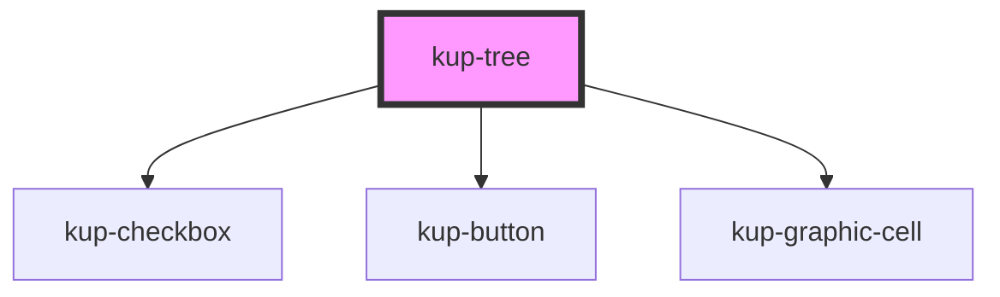

# kup-tree

## Status

Work in progress

#### TODO / Clarify

1. Aggiornare il JSON del componente albero nella wiki di progettazione.
2. Controllare che i dati ed ogetti visibili nelle celle di un albero siano gli stessi che possono essere presenti all'interno di una matrice. In caso affermativo: 
   1. estrarre funzione renderCell da kup-data-table e da kup-tree;
   2. mettere quella funzione in un file esterno per il parsing delle celle;
   3. richiamare la funzione e bindarla con il this nel caso serva utilizzare il this all'interno. (eviterei il binding, può generare incomprensione)
3. La dimensione delle colonne quando il formato tabella è attivo può essere customizzata come per la matrice?  
4. Cosa succede quando la configurazione di un albero rimane la stessa ma vengono completamente cambiati i dati che ci stanno sotto (data).?
   * Mi viene da dire che se presente il flag `expanded` allora al cambiamento deve essere rianalizzato l'albero e i nodi devono essere aperti nuovamente.
5. Decidere assieme se il parametro `data` deve essere una specie di root dell'albero con alcune informazioni aggiuntive o se è sufficiente mettere i primi figli dell'albero.
   * A seconda di come viene impostato cambia come le funzioni di rendering devono essere eseguite.
6. Siccome script di mocking dei dati per i componenti sono usati sia all'interno del progetto Stencil sia all'interno dello showcase,
    può avere senso migrare questi script in un package a se stante all'interno del monorepo? Qualcosa tipo `ketchup-data-factory` che poi può essere importato da ambo i package.
7. Quando un TreeNode è disabilitato può essere aperto o chiuso?

<!-- Auto Generated Below -->

## Properties

| Property                   | Attribute                | Description                                                                                                                                                                                                                                                                                                                                                                                                                                                                                                                                                                                                                                                                                   | Type       | Default     |
| -------------------------- | ------------------------ | --------------------------------------------------------------------------------------------------------------------------------------------------------------------------------------------------------------------------------------------------------------------------------------------------------------------------------------------------------------------------------------------------------------------------------------------------------------------------------------------------------------------------------------------------------------------------------------------------------------------------------------------------------------------------------------------- | ---------- | ----------- |
| `columns`                  | --                       | The columns of the tree when tree visualization is active                                                                                                                                                                                                                                                                                                                                                                                                                                                                                                                                                                                                                                     | `Column[]` | `undefined` |
| `data`                     | --                       | The json data used to populate the tree view.                                                                                                                                                                                                                                                                                                                                                                                                                                                                                                                                                                                                                                                 | `TreeNode` | `undefined` |
| `dynamicExpansionCallback` | --                       | Function that gets invoked when a new set of nodes must be loaded as children of a node. Used in combination with showObjectNavigation.  When useDynamicExpansion is set, the tree component will have two different behaviors depending on the value of this prop. 1 - If this prop is set to null, no callback to download data is available:     the component will emit an event requiring the parent to load the children of the given node. 2 - If this prop is set to have a callback, then the component will automatically make requests to load children of     a given node. After the load has been completed, a different event will be fired to alert the parent of the change. | `Function` | `null`      |
| `expanded`                 | `expanded`               | Flag: the nodes of the whole tree must be already expanded upon loading.                                                                                                                                                                                                                                                                                                                                                                                                                                                                                                                                                                                                                      | `boolean`  | `false`     |
| `selectedNode`             | --                       | An array of integers containing the path to a selected child.\ Groups up the properties SelFirst, SelItem, SelName.                                                                                                                                                                                                                                                                                                                                                                                                                                                                                                                                                                           | `Number[]` | `[]`        |
| `showColumns`              | `show-columns`           | Shows the tree data as a table.                                                                                                                                                                                                                                                                                                                                                                                                                                                                                                                                                                                                                                                               | `boolean`  | `false`     |
| `showHeader`               | `show-header`            | Flag: shows the header of the tree when the tree is displayed as a table.                                                                                                                                                                                                                                                                                                                                                                                                                                                                                                                                                                                                                     | `boolean`  | `false`     |
| `showIcons`                | `show-icons`             | Show the icons of the various nodes of the tree.                                                                                                                                                                                                                                                                                                                                                                                                                                                                                                                                                                                                                                              | `boolean`  | `true`      |
| `showObjectNavigation`     | `show-object-navigation` | When a node has options in its data and is on mouse over state while this prop is true, the node must shows the cog wheel to trigger object navigation upon click.  This will generate an event to inform the navigation object has been activated.                                                                                                                                                                                                                                                                                                                                                                                                                                           | `boolean`  | `false`     |
| `useDynamicExpansion`      | `use-dynamic-expansion`  | When the component must use the dynamic expansion feature to open its nodes, it means that not all the nodes of the tree have been passed inside the data property.  Therefore, when expanding a node, the tree must emit an event (or run a given callback) and wait for the child nodes to be downloaded from the server.  For more information:                                                                                                                                                                                                                                                                                                                                            | `boolean`  | `false`     |

## Events

| Event                      | Description                                       | Type                               |
| -------------------------- | ------------------------------------------------- | ---------------------------------- |
| `kupTreeNodeActionClicked` | When a cell option is clicked                     | `CustomEvent<{ column: string; }>` |
| `kupTreeNodeExpand`        | Fired when a dynamicExpansion has been triggered. | `CustomEvent<{ column: string; }>` |
| `kupTreeNodeSelected`      | Fired when a node of the tree has been selected   | `CustomEvent<{ column: string; }>` |

## CSS Custom Properties

| Name                                                                           | Description                                                |
| ------------------------------------------------------------------------------ | ---------------------------------------------------------- |
| `--tre_node--disabled_opacity, --kup-tre_node--disabled_opacity`               | The opacity of a TreeNode when disabled.                   |
| `--tre_node-expander_color, --kup-tre_node-expander_color`                     | The TreeNode expander icon color.                          |
| `--tre_node-icon_color, --kup-tre_node-icon_color`                             | TreeNode icon color. Applied to all TreeNodes.             |
| `--tre_node-icon_size, --kup-tre_node-icon_size`                               | The TreeNode icon size (includes expand icon).             |
| `--tre_node-indent_width, --kup-tre_node-indent_width`                         | Width of each single indentation of the tree.              |
| `--tre_node_background-color--hover, --kup-tre_node_background-color--hover`   | TreeNode background color when TreeNode is hovered.        |
| `--tre_table-header_background-color, --kup-tre_table-header_background-color` | Allows customization of the table header background color. |

## Dependencies

### Depends on

- [kup-checkbox](..\kup-checkbox)
- [kup-button](..\kup-button)
- [kup-graphic-cell](..\kup-graphic-cell)

### Graph

----------------------------------------------

*Built with [StencilJS](https://stenciljs.com/)*
