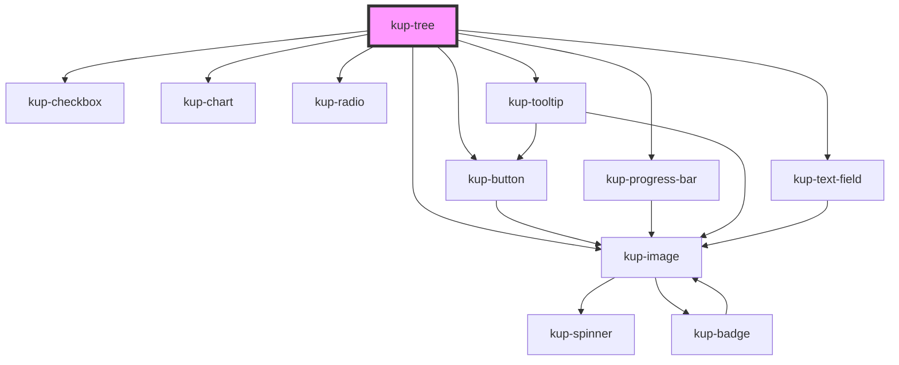

# kup-tree

## Status

Work in progress

## Glossary

A collection of terms used for this component.

**TreeNode**: Any node of the tree data. When rendered, it corresponds to a table row.

**TreeNodeCell**: The cell containing the indentation, open/close icon, TreeNode icon and TreeNode information (rendered both when the tree is hiding or showing the columns).

## About dynamic expansion feature

Dynamic expansion feature allows children of a TreeNode to be dynamically fetched and added to the data.\
There are two ways in which this feature can be achieved.

### Without using callback

The first way, the one people coming from frameworks (such as Vue, React and Angular) will be more accustomed with, is to use the the component without passing a callback to the prop described below.

When using a dynamic expansion with no callback set, `kup-tree` will fire an expand event (see below) with a flag signaling that the TreeNode being expanded is requiring its children to the backend system.\
In order to trigger the correct expansion upon receiving an expansion event, the parent component will need to:

1. fetch the TreeNode children;
2. update the tree data by:
    1. adding the TreeNode children;
    2. set the `isExpanded` flag to `true`;
3. force the component to update by updating the reference of the `data` prop using ES6 spread operator (`...`).

To see a working example of this, I suggest to have a look at the project showcase, under the section `tree > Tree dynamic expansion`, and `ketchup-showcase > src > views > tree > TDynamicExpansion.vue` file, inside the script section.

### By using a callback function

The other, slightly more powerful method to achieve this is by setting a callback on the component.\
`kup-tree` expects the callback to return a JS `Promise` which:

1. if successfully resolved, returns an array of child TreeNodes to be set as children to the expanded element.\
   After the elements have been added, re-renders the component and fires expanded event.
2. an error if the TreeNodes could not be fetched. The component will `console.error()` a message.

In the failure case, it can be useful to notify the error to the parent.\
We must decide if either an error event will be fired or a `throw` error will be executed.

You can find an example of this behavior inside the same resources linked in the previous paragraph.

## Possible future development

### Keyboard support

Currently browsing, opening or closing items by using the keyboard controls is not supported.

Ideally it can be achieved by using `tabindex` for navigation and a check on the `spacebar` and `enter` keys to open or close the TreeNodes.

<!-- Auto Generated Below -->

## Properties

| Property                   | Attribute                  | Description                                                                                                                                                                                                                                                                                                                                                                                                                                                                                                                                                                                                                                                                                   | Type                                                                              | Default     |
| -------------------------- | -------------------------- | --------------------------------------------------------------------------------------------------------------------------------------------------------------------------------------------------------------------------------------------------------------------------------------------------------------------------------------------------------------------------------------------------------------------------------------------------------------------------------------------------------------------------------------------------------------------------------------------------------------------------------------------------------------------------------------------- | --------------------------------------------------------------------------------- | ----------- |
| `autoSelectionNodeMode`    | `auto-selection-node-mode` | Auto select programmatic selectic node                                                                                                                                                                                                                                                                                                                                                                                                                                                                                                                                                                                                                                                        | `boolean`                                                                         | `true`      |
| `columns`                  | --                         | The columns of the tree when tree visualization is active.                                                                                                                                                                                                                                                                                                                                                                                                                                                                                                                                                                                                                                    | `Column[]`                                                                        | `undefined` |
| `customStyle`              | `custom-style`             | Custom style of the component. For more information: https://ketchup.smeup.com/ketchup-showcase/#/customization                                                                                                                                                                                                                                                                                                                                                                                                                                                                                                                                                                               | `string`                                                                          | `undefined` |
| `data`                     | --                         | The json data used to populate the tree view: the basic, always visible tree nodes.                                                                                                                                                                                                                                                                                                                                                                                                                                                                                                                                                                                                           | `TreeNode[]`                                                                      | `[]`        |
| `density`                  | `density`                  | The density of the rows, defaults at 'medium' and can also be set to 'dense' or 'wide'.                                                                                                                                                                                                                                                                                                                                                                                                                                                                                                                                                                                                       | `string`                                                                          | `'medium'`  |
| `dynamicExpansionCallback` | --                         | Function that gets invoked when a new set of nodes must be loaded as children of a node. Used in combination with showObjectNavigation.  When useDynamicExpansion is set, the tree component will have two different behaviors depending on the value of this prop. 1 - If this prop is set to null, no callback to download data is available:     the component will emit an event requiring the parent to load the children of the given node. 2 - If this prop is set to have a callback, then the component will automatically make requests to load children of     a given node. After the load has been completed, a different event will be fired to alert the parent of the change. | `(treeNodeToExpand: TreeNode, treeNodePath: TreeNodePath) => Promise<TreeNode[]>` | `undefined` |
| `expanded`                 | `expanded`                 | Flag: the nodes of the whole tree must be already expanded upon loading. Disabled nodes do NOT get expanded.                                                                                                                                                                                                                                                                                                                                                                                                                                                                                                                                                                                  | `boolean`                                                                         | `false`     |
| `filterValue`              | `filter-value`             | Allows to set initial filter for tree nodes, manages the filter on tree nodes.                                                                                                                                                                                                                                                                                                                                                                                                                                                                                                                                                                                                                | `string`                                                                          | `''`        |
| `hoverScroll`              | `hover-scroll`             | Activates the scroll on hover function                                                                                                                                                                                                                                                                                                                                                                                                                                                                                                                                                                                                                                                        | `boolean`                                                                         | `true`      |
| `selectedNode`             | --                         | An array of integers containing the path to a selected child.\ Groups up the properties SelFirst, SelItem, SelName.                                                                                                                                                                                                                                                                                                                                                                                                                                                                                                                                                                           | `number[]`                                                                        | `[]`        |
| `showColumns`              | `show-columns`             | Shows the tree data as a table.                                                                                                                                                                                                                                                                                                                                                                                                                                                                                                                                                                                                                                                               | `boolean`                                                                         | `false`     |
| `showFilter`               | `show-filter`              | When set to true enables the tree nodes filter.                                                                                                                                                                                                                                                                                                                                                                                                                                                                                                                                                                                                                                               | `boolean`                                                                         | `false`     |
| `showHeader`               | `show-header`              | Flag: shows the header of the tree when the tree is displayed as a table.                                                                                                                                                                                                                                                                                                                                                                                                                                                                                                                                                                                                                     | `boolean`                                                                         | `false`     |
| `showIcons`                | `show-icons`               | Shows the icons of the nodes.                                                                                                                                                                                                                                                                                                                                                                                                                                                                                                                                                                                                                                                                 | `boolean`                                                                         | `true`      |
| `showObjectNavigation`     | `show-object-navigation`   | When a node has options in its data and is on mouse over state while this prop is true, the node must shows the cog wheel to trigger object navigation upon click.  This will generate an event to inform the navigation object has been activated.                                                                                                                                                                                                                                                                                                                                                                                                                                           | `boolean`                                                                         | `false`     |
| `useDynamicExpansion`      | `use-dynamic-expansion`    | When the component must use the dynamic expansion feature to open its nodes, it means that not all the nodes of the tree have been passed inside the data property.  Therefore, when expanding a node, the tree must emit an event (or run a given callback) and wait for the child nodes to be downloaded from the server.  For more information:                                                                                                                                                                                                                                                                                                                                            | `boolean`                                                                         | `false`     |

## Events

| Event                      | Description                                                                                                                                                                 | Type                                                                                                                                          |
| -------------------------- | --------------------------------------------------------------------------------------------------------------------------------------------------------------------------- | --------------------------------------------------------------------------------------------------------------------------------------------- |
| `kupDetailRequest`         | When a tooltip request detail data                                                                                                                                          | `CustomEvent<{ cell: Cell; tooltip: EventTarget; }>`                                                                                          |
| `kupLoadRequest`           | When a tooltip request initial data                                                                                                                                         | `CustomEvent<{ cell: Cell; tooltip: EventTarget; }>`                                                                                          |
| `kupOptionClicked`         | When a cell option is clicked. If the cell option is the one of the TreeNodeCell, then column will be set to the fixed value {name: "TreeNodeCell", title: "TreeNodeCell"}. | `CustomEvent<{ cell: Cell; column: Column; treeNode: TreeNode; }>`                                                                            |
| `kupTreeNodeButtonClicked` |                                                                                                                                                                             | `CustomEvent<{ treeNodePath: TreeNodePath; treeNode: TreeNode; column: Column; columnName: string; auto: boolean; }>`                         |
| `kupTreeNodeCollapse`      | Fired when a TreeNode gets collapsed (closed).                                                                                                                              | `CustomEvent<{ treeNodePath: TreeNodePath; treeNode: TreeNode; }>`                                                                            |
| `kupTreeNodeExpand`        | Fired when a node expansion ion has been triggered. Contains additional data when the tree is using the dynamicExpansion feature.                                           | `CustomEvent<{ treeNodePath: TreeNodePath; treeNode: TreeNode; usesDynamicExpansion?: boolean; dynamicExpansionRequireChildren?: boolean; }>` |
| `kupTreeNodeSelected`      | Fired when a node of the tree has been selected                                                                                                                             | `CustomEvent<{ treeNodePath: TreeNodePath; treeNode: TreeNode; columnName: string; auto: boolean; }>`                                         |

## Methods

### `refreshCustomStyle(customStyleTheme: string) => Promise<void>`

#### Returns

Type: `Promise<void>`

## Dependencies

### Depends on

- [kup-button](../kup-button)
- [kup-image](../kup-image)
- [kup-checkbox](../kup-checkbox)
- [kup-chart](../kup-chart)
- [kup-progress-bar](../kup-progress-bar)
- [kup-radio](../kup-radio)
- [kup-tooltip](../kup-tooltip)
- [kup-text-field](../kup-text-field)

### Graph

----------------------------------------------

*Built with [StencilJS](https://stenciljs.com/)*
