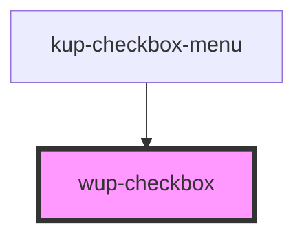

# wup-checkbox

<!-- Auto Generated Below -->

## Properties

| Property        | Attribute       | Description                                                                                      | Type      | Default |
| --------------- | --------------- | ------------------------------------------------------------------------------------------------ | --------- | ------- |
| `checked`       | `checked`       | Defaults at false. When set to true, the component will be set to 'checked'.                     | `boolean` | `false` |
| `disabled`      | `disabled`      | Defaults at false. When set to true, the component is disabled.                                  | `boolean` | `false` |
| `indeterminate` | `indeterminate` | Defaults at false. When set to true, the component will be set to 'indeterminate'.               | `boolean` | `false` |
| `labelleft`     | `labelleft`     | Defaults at null. When specified, its content is shown to the left of the component as a label.  | `string`  | `null`  |
| `labelright`    | `labelright`    | Defaults at null. When specified, its content is shown to the right of the component as a label. | `string`  | `null`  |

## Events

| Event               | Description | Type                              |
| ------------------- | ----------- | --------------------------------- |
| `kupCheckboxBlur`   |             | `CustomEvent<{ value: string; }>` |
| `kupCheckboxChange` |             | `CustomEvent<{ value: string; }>` |
| `kupCheckboxClick`  |             | `CustomEvent<{ value: string; }>` |
| `kupCheckboxFocus`  |             | `CustomEvent<{ value: string; }>` |
| `kupCheckboxInput`  |             | `CustomEvent<{ value: string; }>` |

## Dependencies

### Used by

 - [kup-checkbox-menu](../kup-checkbox-menu)

### Graph

----------------------------------------------

*Built with [StencilJS](https://stenciljs.com/)*
