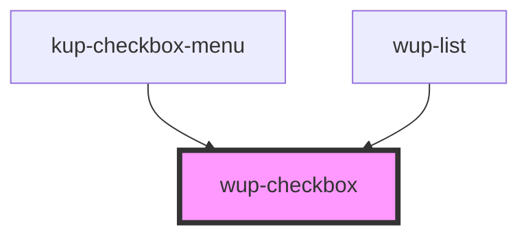

# wup-checkbox

<!-- Auto Generated Below -->

## Properties

| Property        | Attribute       | Description                                                                          | Type      | Default     |
| --------------- | --------------- | ------------------------------------------------------------------------------------ | --------- | ----------- |
| `checked`       | `checked`       | Defaults at false. When set to true, the component will be set to 'checked'.         | `boolean` | `false`     |
| `customStyle`   | `custom-style`  | Custom style to be passed to the component.                                          | `string`  | `undefined` |
| `disabled`      | `disabled`      | Defaults at false. When set to true, the component is disabled.                      | `boolean` | `false`     |
| `indeterminate` | `indeterminate` | Defaults at false. When set to true, the component will be set to 'indeterminate'.   | `boolean` | `false`     |
| `label`         | `label`         | Defaults at null. When specified, its content will be shown as a label.              | `string`  | `null`      |
| `leadingLabel`  | `leading-label` | Defaults at false. When set to true, the label will be on the left of the component. | `boolean` | `false`     |

## Events

| Event               | Description | Type                              |
| ------------------- | ----------- | --------------------------------- |
| `kupCheckboxBlur`   |             | `CustomEvent<{ value: string; }>` |
| `kupCheckboxChange` |             | `CustomEvent<{ value: string; }>` |
| `kupCheckboxClick`  |             | `CustomEvent<{ value: string; }>` |
| `kupCheckboxFocus`  |             | `CustomEvent<{ value: string; }>` |
| `kupCheckboxInput`  |             | `CustomEvent<{ value: string; }>` |

## Dependencies

### Used by

 - [kup-checkbox-menu](../kup-checkbox-menu)
 - [wup-list](../wup-list)

### Graph

----------------------------------------------

*Built with [StencilJS](https://stenciljs.com/)*
