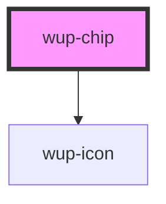

# wup-chip

<!-- Auto Generated Below -->

## Properties

| Property      | Attribute      | Description                                                                    | Type                     | Default     |
| ------------- | -------------- | ------------------------------------------------------------------------------ | ------------------------ | ----------- |
| `customStyle` | `custom-style` | Custom style to be passed to the component.                                    | `string`                 | `undefined` |
| `data`        | --             | List of elements.                                                              | `ComponentChipElement[]` | `[]`        |
| `type`        | `type`         | The type of chip. Available types: input, filter, choice or empty for default. | `string`                 | `undefined` |

## Events

| Event              | Description | Type                                               |
| ------------------ | ----------- | -------------------------------------------------- |
| `kupChipBlur`      |             | `CustomEvent<{ value: string; }>`                  |
| `kupChipClick`     |             | `CustomEvent<{ index: number; el: EventTarget; }>` |
| `kupChipError`     |             | `CustomEvent<{ el: EventTarget; }>`                |
| `kupChipFocus`     |             | `CustomEvent<{ value: string; }>`                  |
| `kupChipIconClick` |             | `CustomEvent<{ index: number; el: EventTarget; }>` |

## Dependencies

### Depends on

- [wup-icon](../wup-icon)

### Graph

----------------------------------------------

*Built with [StencilJS](https://stenciljs.com/)*
