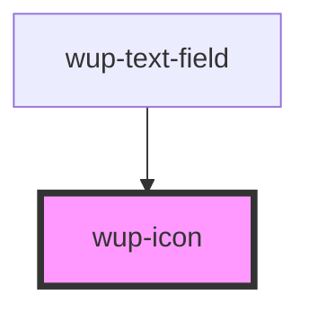

# wup-template

<!-- Auto Generated Below -->

## Properties

| Property     | Attribute    | Description                                                                                                            | Type     | Default                   |
| ------------ | ------------ | ---------------------------------------------------------------------------------------------------------------------- | -------- | ------------------------- |
| `color`      | `color`      | The color of the icon, defaults to the main color of the app.                                                          | `string` | `'var(--kup-icon-color)'` |
| `dimensions` | `dimensions` | The width and height of the icon, defaults to 100%. They are bound together because icons should generally be squared. | `string` | `'100%'`                  |
| `name`       | `name`       | The name of the icon.                                                                                                  | `string` | `undefined`               |
| `type`       | `type`       | The type of the icon, defaults to "svg".                                                                               | `string` | `'svg'`                   |

## Dependencies

### Used by

 - [wup-text-field](../wup-text-field)

### Graph

----------------------------------------------

*Built with [StencilJS](https://stenciljs.com/)*
