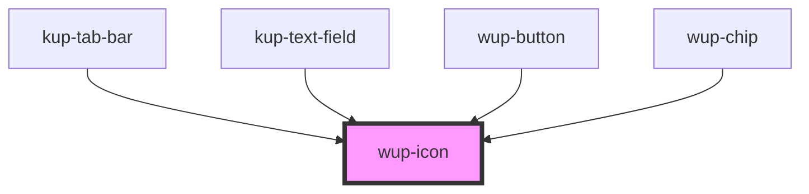

# wup-template

<!-- Auto Generated Below -->

## Properties

| Property      | Attribute      | Description                                                                                                            | Type     | Default                   |
| ------------- | -------------- | ---------------------------------------------------------------------------------------------------------------------- | -------- | ------------------------- |
| `color`       | `color`        | The color of the icon, defaults to the main color of the app.                                                          | `string` | `'var(--kup-icon-color)'` |
| `customStyle` | `custom-style` | Custom style to be passed to the component.                                                                            | `string` | `undefined`               |
| `dimensions`  | `dimensions`   | The width and height of the icon, defaults to 100%. They are bound together because icons should generally be squared. | `string` | `'100%'`                  |
| `name`        | `name`         | The name of the icon.                                                                                                  | `string` | `undefined`               |
| `type`        | `type`         | The type of the icon, defaults to "svg".                                                                               | `string` | `'svg'`                   |

## Dependencies

### Used by

 - [kup-tab-bar](../kup-tab-bar)
 - [kup-text-field](../kup-text-field)
 - [wup-button](../wup-button)
 - [wup-chip](../wup-chip)

### Graph

----------------------------------------------

*Built with [StencilJS](https://stenciljs.com/)*
