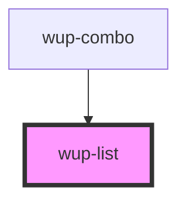

# wup-list

<!-- Auto Generated Below -->

## Properties

| Property       | Attribute       | Description                                                                | Type                     | Default                        |
| -------------- | --------------- | -------------------------------------------------------------------------- | ------------------------ | ------------------------------ |
| `dense`        | `dense`         |                                                                            | `boolean`                | `false`                        |
| `isFilterable` | `is-filterable` | Marks the list as filterable, allowing an input text to filter the options | `boolean`                | `false`                        |
| `items`        | --              |                                                                            | `ComponentListElement[]` | `[]`                           |
| `listId`       | `list-id`       |                                                                            | `string`                 | `'WupList-myId'`               |
| `roleType`     | `role-type`     |                                                                            | `string`                 | `WupList.ROLE_LISTBOX`         |
| `selectable`   | `selectable`    |                                                                            | `string`                 | `WupList.SELECTABLE_NO_SELECT` |

## Events

| Event           | Description | Type                                                                |
| --------------- | ----------- | ------------------------------------------------------------------- |
| `kupListBlur`   | Events.     | `CustomEvent<{ selected: ComponentListElement; el: EventTarget; }>` |
| `kupListChange` |             | `CustomEvent<{ selected: ComponentListElement; el: EventTarget; }>` |
| `kupListClick`  |             | `CustomEvent<{ selected: ComponentListElement; el: EventTarget; }>` |
| `kupListFocus`  |             | `CustomEvent<{ selected: ComponentListElement; el: EventTarget; }>` |
| `kupListInput`  |             | `CustomEvent<{ selected: ComponentListElement; el: EventTarget; }>` |

## Dependencies

### Used by

 - [wup-combo](..\wup-combo)

### Graph

----------------------------------------------

*Built with [StencilJS](https://stenciljs.com/)*
