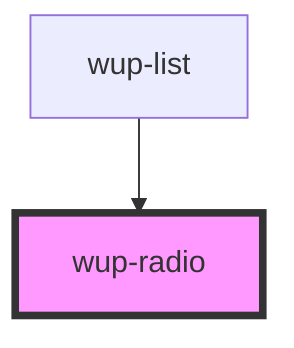

# wup-radio

<!-- Auto Generated Below -->

## Properties

| Property       | Attribute       | Description                                                                          | Type                      | Default        |
| -------------- | --------------- | ------------------------------------------------------------------------------------ | ------------------------- | -------------- |
| `customStyle`  | `custom-style`  | Custom style to be passed to the component.                                          | `string`                  | `undefined`    |
| `data`         | --              | List of elements.                                                                    | `ComponentRadioElement[]` | `[]`           |
| `disabled`     | `disabled`      | Defaults at false. When set to true, the component is disabled.                      | `boolean`                 | `false`        |
| `leadingLabel` | `leading-label` | Defaults at false. When set to true, the label will be on the left of the component. | `boolean`                 | `false`        |
| `name`         | `name`          | Defaults at null. It's the name that binds the radio buttons together.               | `string`                  | `'radio-list'` |

## Events

| Event            | Description | Type                                                |
| ---------------- | ----------- | --------------------------------------------------- |
| `kupRadioBlur`   |             | `CustomEvent<{ value: string; checked: boolean; }>` |
| `kupRadioChange` |             | `CustomEvent<{ value: string; checked: boolean; }>` |
| `kupRadioClick`  |             | `CustomEvent<{ value: string; checked: boolean; }>` |
| `kupRadioFocus`  |             | `CustomEvent<{ value: string; checked: boolean; }>` |
| `kupRadioInput`  |             | `CustomEvent<{ value: string; checked: boolean; }>` |

## Dependencies

### Used by

 - [wup-list](../wup-list)

### Graph

----------------------------------------------

*Built with [StencilJS](https://stenciljs.com/)*
