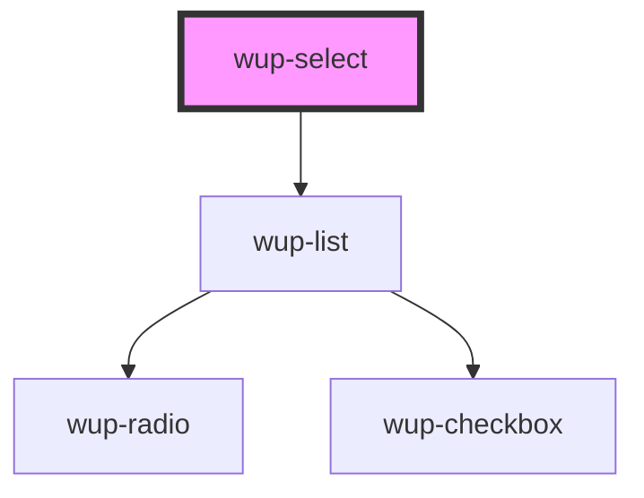

# wup-select

<!-- Auto Generated Below -->

## Properties

| Property       | Attribute       | Description                                                                | Type                     | Default                         |
| -------------- | --------------- | -------------------------------------------------------------------------- | ------------------------ | ------------------------------- |
| `data`         | --              |                                                                            | `ComponentListElement[]` | `[]`                            |
| `disabled`     | `disabled`      | Defaults at false. When set to true, the component is disabled.            | `boolean`                | `false`                         |
| `isFilterable` | `is-filterable` | Marks the list as filterable, allowing an input text to filter the options | `boolean`                | `false`                         |
| `selectId`     | `select-id`     |                                                                            | `string`                 | `'WupSelect-myId'`              |
| `selectable`   | `selectable`    |                                                                            | `string`                 | `WupList.SELECTABLE_ONE_SELECT` |

## Events

| Event             | Description    | Type                           |
| ----------------- | -------------- | ------------------------------ |
| `kupSelectBlur`   | Event example. | `CustomEvent<{ value: any; }>` |
| `kupSelectChange` |                | `CustomEvent<{ value: any; }>` |
| `kupSelectClick`  |                | `CustomEvent<{ value: any; }>` |
| `kupSelectFocus`  |                | `CustomEvent<{ value: any; }>` |
| `kupSelectInput`  |                | `CustomEvent<{ value: any; }>` |

## Dependencies

### Depends on

- [wup-list](../wup-list)

### Graph

----------------------------------------------

*Built with [StencilJS](https://stenciljs.com/)*
