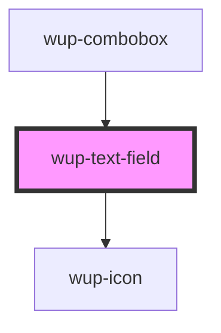

# wup-text-field

<!-- Auto Generated Below -->

## Properties

| Property            | Attribute             | Description                                                                               | Type      | Default     |
| ------------------- | --------------------- | ----------------------------------------------------------------------------------------- | --------- | ----------- |
| `customStyle`       | `custom-style`        | Custom style to be passed to the component.                                               | `string`  | `undefined` |
| `disabled`          | `disabled`            | Defaults at false. When set to true, the component is disabled.                           | `boolean` | `false`     |
| `fullHeight`        | `full-height`         | Defaults at false. When set to true, the component will be rendered at full height.       | `boolean` | `false`     |
| `fullWidth`         | `full-width`          | Defaults at false. When set to true, the component will be rendered at full width.        | `boolean` | `false`     |
| `helper`            | `helper`              | Defaults at null. When set, its content will be shown as a help text below the field.     | `string`  | `null`      |
| `helperWhenFocused` | `helper-when-focused` | Defaults at false. When set, the helper will be shown only when the field is focused.     | `boolean` | `false`     |
| `icon`              | `icon`                | Defaults at null. When set, the text-field will show this icon.                           | `string`  | `null`      |
| `initialValue`      | `initial-value`       | Sets the initial value of the component                                                   | `string`  | `''`        |
| `inputType`         | `input-type`          | The HTML type of the input element. It has no effect on text areas.                       | `string`  | `'text'`    |
| `label`             | `label`               | Defaults at null. When set, its content will be shown as a label.                         | `string`  | `null`      |
| `leadingLabel`      | `leading-label`       | Defaults at false. When set to true, the label will be on the left of the component.      | `boolean` | `false`     |
| `maxLength`         | `max-length`          | Defaults at null. When set, the helper will display a character counter.                  | `number`  | `null`      |
| `outlined`          | `outlined`            | Defaults at false. When set to true, the component will be rendered as an outlined field. | `boolean` | `false`     |
| `shaped`            | `shaped`              | Defaults at false. When set to true, the button will be rendered with shaped edges.       | `boolean` | `false`     |
| `textArea`          | `text-area`           | Defaults at false. When set to true, the component will be rendered as a textarea.        | `boolean` | `false`     |
| `trailingIcon`      | `trailing-icon`       | Defaults at null. When set, the icon will be shown after the text.                        | `boolean` | `false`     |
| `trailingLabel`     | `trailing-label`      | Defaults at false. When set to true, the label will be on the right of the component.     | `boolean` | `false`     |

## Events

| Event                   | Description | Type                              |
| ----------------------- | ----------- | --------------------------------- |
| `kupTextFieldBlur`      |             | `CustomEvent<{ value: string; }>` |
| `kupTextFieldChange`    |             | `CustomEvent<{ value: string; }>` |
| `kupTextFieldClick`     |             | `CustomEvent<{ value: string; }>` |
| `kupTextFieldFocus`     |             | `CustomEvent<{ value: string; }>` |
| `kupTextFieldIconClick` |             | `CustomEvent<{ value: string; }>` |
| `kupTextFieldInput`     |             | `CustomEvent<{ value: string; }>` |

## Dependencies

### Used by

 - [wup-combobox](../wup-combobox)

### Depends on

- [wup-icon](../wup-icon)

### Graph

----------------------------------------------

*Built with [StencilJS](https://stenciljs.com/)*
